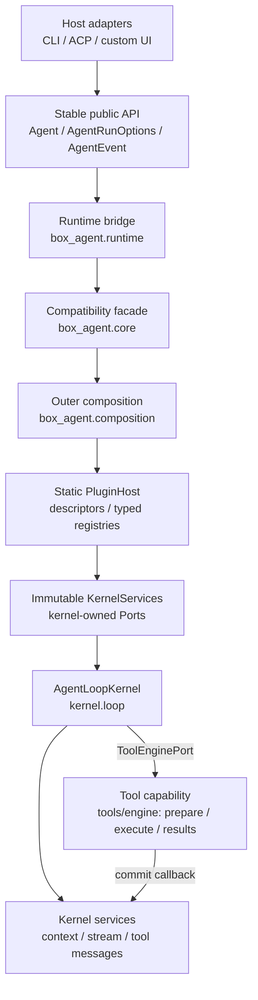

# Box-Agent Layered Architecture

## Decision

Box-Agent uses a stable public API, a host-neutral kernel, and a static
composition boundary. Product behavior and format-specific execution policy
belong outside `box_agent/core.py` and `box_agent/kernel/`.



The production call path is therefore **CLI/ACP → Agent → runtime → core
compatibility facade → outer composition/PluginHost → immutable
KernelServices → AgentLoopKernel**. Dependencies point toward kernel-owned
contracts. `box_agent/kernel/` never imports PluginHost, composition, ACP, CLI,
officev3, or another product adapter. Plugins depend on `kernel.ports`; the
kernel receives already resolved services and never queries a registry.
Application and capability modules must not import `box_agent.core` directly.

## Layers and ownership

| Layer | Main code | Responsibility |
| --- | --- | --- |
| Product / integration | `box_agent/acp/`, `box_agent/cli.py`, host code | Protocol translation, host metadata, ACP protocol rendering, CLI entrypoint wiring, and host-selected Skills |
| Capability | `box_agent/tools/` except `base.py`, `box_agent/skills/`, provider implementations in `box_agent/llm/`, `memory.py` | Tools, self-contained Skills, providers, storage, and domain validators |
| Stable public API | `agent.py`, `runtime.py`, `core.py`, `events.py`, `schema.py` | Backward-compatible calls and event/schema contracts |
| Outer composition | `composition.py`, `plugins/` | Explicit descriptors, validation, dependency resolution, scoped activation, immutable service assembly, and disposal |
| Stable kernel | `kernel/`, `session_log.py`, `loop_guards.py`, `hooks.py`, `artifacts.py`, `tools/base.py` | Conversation invariants, tool-call closure, persistence, Ports and security contracts; concrete tool scheduling and budgets live in tools/engine |

“Core-owned” means a core maintainer reviews and approves the change. It does
not mean these files can never change.

## Public entry points

Application adapters run a turn through `Agent.run_events()` and provide a
complete `AgentRunOptions` snapshot:

```python
from dataclasses import replace

options = replace(
    agent.default_run_options(),
    session_id=host_session_id,
    permission_negotiator=permission_adapter,
    hooks=host_hooks,
)

async for event in agent.run_events(options=options):
    await render_for_host(event)
```

Framework capabilities that intentionally create an isolated low-level loop,
such as `SubAgentTool`, may import `run_agent_loop` from
`box_agent.runtime`. Production code outside that bridge must not import
`box_agent.core`.

Existing call forms and defaults remain compatible.
`runtime.invoke_tool_with_permissions()` additionally accepts optional
`invocation_context` and `is_cancelled`; its tuple return is unchanged. In particular, callers do
not pass a PluginHost, Registry, or `KernelServices`. ACP still consumes
`Agent.run_events(options=...)` and renders those events into protocol updates.
CLI still calls `Agent.run()`, whose `Agent._render_event()` owns terminal
rendering. Kernel and composition only produce events; neither renders them.

## Kernel modules and call relationships

`AgentLoopKernel` owns the single state machine and event order. Its supporting
modules have deliberately narrow responsibilities:

| Module | Responsibility |
| --- | --- |
| `kernel/loop.py` | Step orchestration, stop-reason mapping, event ordering, and calls into the other kernel modules |
| `kernel/context_engine.py` | Context estimation, compaction, summarization fallback, recent-message selection, and runtime-state recovery |
| `kernel/stream_controller.py` | Provider stream liveness, activity events, stale detection, and stream recovery |
| `tools/engine/execution.py` | Single validated invocation and streaming permission continuation; legacy permission module re-exports it |
| `tools/engine/engine.py`, `scheduler.py`, `budget.py` | Run-scoped call orchestration, request-bound targets, original scheduling/cancellation and budgets |
| `tools/engine/results.py`, `tools/*_result_adapter.py` | One result path and capability-owned browser/file/Skill/search/artifact adaptation |
| `kernel/tool_messages.py` | Durable pre-effect call record, final reply commit and interrupted-call repair |
| `kernel/ports.py` | Minimal kernel-owned Protocols and the immutable `KernelServices` bundle |

The main relationship is:

```text
AgentLoopKernel
  -> Context Engine before an LLM request
  -> Stream Controller while reading the provider
  -> Tool Engine when the response contains tool calls
       -> Permission Gateway when a tool requests approval
       -> Tool Result Pipeline for every serial or parallel completion
  -> kernel tool_messages through call/result commit callbacks
  -> KernelServices for already resolved capabilities
```

`core.py` remains a compatibility facade. Former Core responsibilities now map
as follows:

| Former `core.py` responsibility/helper group | Current owner |
| --- | --- |
| Agent loop and stop/event invariants | `kernel/loop.py` |
| Context sizing, summary, compaction, and recovery helpers | `kernel/context_engine.py` |
| Provider-stale and activity stream helpers | `kernel/stream_controller.py` |
| Permission negotiation helpers | `tools/engine/execution.py` (legacy kernel re-export) |
| Tool scheduling, parallelism, cancellation, and budgets | `tools/engine/` (legacy kernel re-exports) |
| Tool-result preparation and capability adaptations | `tools/engine/results.py` and tools adapters; final history commit in `kernel/tool_messages.py` |
| Legacy helper imports and timing-default monkeypatch behavior | `core.py` re-exports/wrappers |

## Static plugins, registries, and replacement

Plugin composition is startup-static and follows one lifecycle:

```text
discover -> validate -> resolve dependencies -> activate -> dispose
```

`discover` reads only the descriptor collection explicitly supplied to the
host. `validate` checks IDs, versions, declared Port types, dependency names,
and registry cardinality before any factory runs. Dependency resolution creates
a deterministic topological order. Activation creates or reuses scoped
instances, freezes an exact-Port Registry view, and builds one immutable
`KernelServices`. Disposal runs owned disposers once in reverse activation
order; partial activation is rolled back the same way.

Each Port declares one Registry cardinality:

- **required-single** must have exactly one implementation before activation;
- **optional-single** has zero or one implementation and rejects ambiguity;
- **multi** preserves every implementation in deterministic registration order.

Descriptors have **process**, **session**, or **run** scope. Process instances
are reused by a host until it closes. Session instances are isolated by an
explicit session key and released with that session. Run instances belong to
one activation and are disposed when it ends. The default compatibility path
uses a fresh host for a legacy run and captures the caller's existing objects
without transferring their ownership.

To replace a capability, a composition owner prepares an explicit descriptor
set, removes/replaces the descriptor for that exact kernel Port, and supplies
the replacement descriptor before `validate`/`activate`. The activated
Registry is then converted to `KernelServices` and passed to
`AgentLoopKernel`; replacement never occurs inside a running kernel. This is
an internal composition seam, not a new parameter or configuration key on
Agent, CLI, ACP, runtime, or Core.

This version intentionally has no Python entry-point scanning, directory
scanning, hot loading/unloading, public plugin configuration, or
`WorkflowPolicy`. Dynamic plugin discovery and packaged-runtime deployment are
not implied by this architecture.

## Session persistence and recovery

`SessionLog` is the only source of truth for durable Agent session state. It
records and replays generic facts: messages, tool calls and results, goals,
plans, todos, active Skills, compaction records, and turn boundaries.

Active Skills are restored from the current SkillLoader content. A historical
content hash mismatch does not block recovery. In-memory hashes reflect the
current content, and restoration does not rewrite historical logs.

A Session owns one normalized cwd for its entire lifetime. Opening the same
Session with another workspace fails before the log is repaired or mutated.
Syntactically equivalent paths are accepted; a symlink alias is a distinct
workspace identity.

Legacy workflow-paused logs are downgraded during replay. Generic conversation
state and durable artifacts remain available, while old synthetic workflow
state is filtered and no domain state machine is reconstructed. Historical
checkpoint and owner files are not read, rewritten, or automatically deleted.

## Waiting for user input

Trusted interactive tools opt into `Tool.ends_turn_on_success`. A successful
request produces the generic `StopReason.WAITING_FOR_USER`; the kernel does
not continue with sibling tools or another model call. ACP maps this internal
reason to protocol `end_turn` and reports generic `runStatus:
waiting_for_user` metadata.

## Skills and domain policy

Skill activation is driven by an explicit invocation, current matcher results,
host-selected Skill names, or generic capability metadata. Host selection is
authoritative for the turn, so semantic matching does not append a competing
domain Skill.

Format-specific authoring stages, validators, scaffolders, finalizers, quality
rules, and recovery instructions belong in the corresponding Skill or plugin.
They derive progress from Session Log context and durable artifacts. The
kernel, CLI, and ACP do not infer delivery completeness, rebuild domain stages,
or force hidden continuation calls. `ArtifactEvent` reports artifact facts; it
does not certify that a task is complete.

## Where a change belongs

| Requirement | Put it here |
| --- | --- |
| Add a tool or external ability | A `Tool` implementation, Skill, or MCP server |
| Add a format-specific workflow or validator | The corresponding Skill or plugin |
| Add a model provider or wire quirk | `box_agent/llm/` |
| Change ACP fields, session metadata, or host rendering | `box_agent/acp/` |
| Change terminal commands or display | `box_agent/cli.py` |
| Change durable generic session facts | `session_log.py` and its replay tests |
| Add a host-neutral event or run option | Stable API/kernel, with core-team review |
| Change scheduling, cancellation, tool-call closure, or security invariants | Kernel, with core-team review |

If a product feature appears to require a Core edit, first ask whether it can
be expressed as a Tool, Skill, Hook, event consumer, or run option. If none is
sufficient, add the smallest generic contract; never embed a product name,
artifact format, or one domain state machine in the kernel.

## Automated boundary

`tests/test_architecture_boundaries.py` enforces the runtime bridge, prevents
Core dependencies on application adapters or removed workflow modules, and
checks that presentation state does not re-enter the stable kernel. Focused
behavior tests cover Session Log recovery, immutable cwd, generic waiting,
direct budgets, Skill preload, ACP translation, and legacy-file non-mutation.
