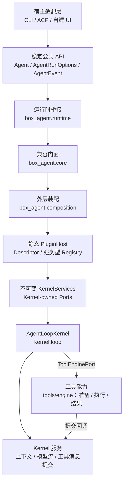

# Box-Agent 分层架构

## 架构决定

Box-Agent 采用稳定公共 API、宿主无关 Kernel 与静态装配边界。产品行为和格式
专用执行策略不应进入 `box_agent/core.py` 或 `box_agent/kernel/`。



生产调用路径因此固定为：**CLI/ACP → Agent → runtime → core 兼容门面 →
外层 composition/PluginHost → 不可变 KernelServices → AgentLoopKernel**。
依赖方向指向 Kernel 自己拥有的契约。`box_agent/kernel/` 绝不导入
PluginHost、composition、ACP、CLI、officev3 或其他产品适配器。Plugin 依赖
`kernel.ports`；Kernel 只接收已经解析的服务，不查询 Registry。产品层与能力层
也不能直接导入 `box_agent.core`。

## 层级与职责

| 层级 | 主要代码 | 职责 |
| --- | --- | --- |
| 产品 / 接入层 | `box_agent/acp/`、`box_agent/cli.py`、宿主代码 | 协议转换、宿主元数据、ACP 协议渲染、CLI 入口接线与宿主明确选择 Skill |
| 能力层 | `box_agent/tools/`（除 `base.py`）、`box_agent/skills/`、`box_agent/llm/` 中的 Provider、`memory.py` | Tool、自包含 Skill、Provider、存储与领域校验器 |
| 稳定公共 API | `agent.py`、`runtime.py`、`core.py`、`events.py`、`schema.py` | 向后兼容的调用方式与事件/schema 契约 |
| 外层装配 | `composition.py`、`plugins/` | 显式 Descriptor、校验、依赖解析、分 Scope 激活、不可变服务装配与释放 |
| 稳定 Kernel | `kernel/`、`session_log.py`、`loop_guards.py`、`hooks.py`、`artifacts.py`、`tools/base.py` | 对话不变量、调用闭合、持久化、Ports 与安全契约；具体工具调度和预算归 tools/engine |

“核心团队维护”表示修改需要核心维护者评审，不表示这些文件永远不能变化。

## 公共接入方式

产品适配器通过 `Agent.run_events()` 执行一轮，并提供完整的
`AgentRunOptions` 快照：

```python
from dataclasses import replace

options = replace(
    agent.default_run_options(),
    session_id=host_session_id,
    permission_negotiator=permission_adapter,
    hooks=host_hooks,
)

async for event in agent.run_events(options=options):
    await render_for_host(event)
```

确实需要独立低层循环的框架能力（例如 `SubAgentTool`）可以从
`box_agent.runtime` 导入 `run_agent_loop`。其他生产代码不得直接导入
`box_agent.core`。

`Agent.run_events()`、`Agent.run()`、`box_agent.runtime.run_agent_loop()`、
`box_agent.runtime.invoke_tool_with_permissions()` 和
`box_agent.core.run_agent_loop()` 的原调用形式与默认值保持兼容。独立调用
`invoke_tool_with_permissions` 新增可选 `invocation_context` / `is_cancelled`，原 tuple 返回不变。调用方不会新增
PluginHost、Registry 或 `KernelServices` 参数。ACP 仍消费
`Agent.run_events(options=...)` 并把事件渲染成协议更新；CLI 仍调用
`Agent.run()`，终端渲染由其中的 `Agent._render_event()` 负责。Kernel 与
composition 只产生事件，均不负责渲染。

## Kernel 模块与调用关系

`AgentLoopKernel` 维护唯一状态机和事件顺序，各辅助模块的职责保持窄而明确：

| 模块 | 职责 |
| --- | --- |
| `kernel/loop.py` | Step 编排、StopReason 映射、事件顺序及其他 Kernel 模块的调用 |
| `kernel/context_engine.py` | 上下文估算、压缩、摘要回退、最近消息选择与运行状态恢复 |
| `kernel/stream_controller.py` | Provider 流存活性、活动事件、stale 检测与流恢复 |
| `tools/engine/execution.py` | 共同的校验调用与流式权限继续；旧 permission 模块兼容导出 |
| `tools/engine/engine.py`、`scheduler.py`、`budget.py` | 每 run 调用编排、本次请求目标、原调度/取消与预算 |
| `tools/engine/results.py`、`tools/*_result_adapter.py` | 串并行统一结果完成；浏览器、文件、Skill、搜索和产物的能力适配 |
| `kernel/tool_messages.py` | 副作用前记录最终参数、提交最终回复与修复中断调用 |
| `kernel/ports.py` | Kernel-owned 最小 Protocol 与不可变 `KernelServices` 容器 |

主要调用关系为：

```text
AgentLoopKernel
  -> LLM 请求前调用 Context Engine
  -> 读取 Provider 时调用 Stream Controller
  -> 响应包含 ToolCall 时调用 Tool Engine
       -> 工具请求授权时调用 Permission Gateway
       -> 每个串行或并行完成项都进入 Tool Result Pipeline
  -> 通过 kernel tool_messages 回调提交调用和最终回复
  -> 只从 KernelServices 获取已解析能力
```

`core.py` 保持为兼容门面。原 Core 职责当前映射如下：

| 原 `core.py` 职责 / helper 组 | 当前归属 |
| --- | --- |
| Agent 循环与停止/事件不变量 | `kernel/loop.py` |
| 上下文大小、摘要、压缩与恢复 helper | `kernel/context_engine.py` |
| Provider stale 与活动流 helper | `kernel/stream_controller.py` |
| 权限协商 helper | `tools/engine/execution.py`，旧 kernel 入口兼容导出 |
| 工具调度、并行、取消与预算 | `tools/engine/`，旧 kernel 入口兼容导出 |
| 工具结果及专项适配 | `tools/engine/results.py` 和 tools adapters；最终历史提交由 `kernel/tool_messages.py` 负责 |
| 旧 helper 导入路径与计时默认值 monkeypatch 行为 | `core.py` 重导出 / wrapper |

## 静态 Plugin、Registry 与能力替换

Plugin 装配只在启动/激活边界静态进行，生命周期固定为：

```text
discover -> validate -> resolve dependencies -> activate -> dispose
```

`discover` 只读取调用方显式提供的 Descriptor 集合；`validate` 在任何 factory
运行前校验 ID、版本、声明的 Port 类型、依赖名称与 Registry 基数；依赖解析给出
确定性拓扑顺序；`activate` 创建或复用分 Scope 实例，冻结 exact-Port Registry
视图并生成一个不可变 `KernelServices`；`dispose` 按激活逆序且只执行一次，部分
激活失败时也按同样规则回滚。

每个 Port 只采用一种 Registry 基数语义：

- **required-single**：激活前必须且只能有一个实现；
- **optional-single**：允许零个或一个实现，拒绝歧义；
- **multi**：按确定性注册顺序保留全部实现。

Descriptor 支持 **process**、**session** 和 **run** Scope。Process 实例由同一个
Host 复用直至关闭；Session 实例用显式 session key 隔离，并随该 Session 释放；
Run 实例只属于一次 activation，并在结束时释放。默认兼容路径为每次旧接口调用
创建新 Host，并捕获调用方已有对象但不接管其所有权。

替换能力时，装配层先准备显式 Descriptor 集合，删除/替换目标 Kernel Port 对应
的 Descriptor，并在 `validate`/`activate` 前加入替代 Descriptor。激活后的
Registry 再转换为 `KernelServices` 并传给 `AgentLoopKernel`；运行中的 Kernel
不会发生替换。这是内部装配接缝，不会成为 Agent、CLI、ACP、runtime 或 Core 的
新参数或配置键。

当前版本明确不支持 Python entry-point 扫描、目录扫描、热加载/热卸载、公共
Plugin 配置或 `WorkflowPolicy`。本架构也不表示已完成动态插件发现或已部署打包
运行时。

## Session 持久化与恢复

`SessionLog` 是 Agent 会话持久化状态的唯一事实源。它记录并恢复消息、工具
调用与结果、Goal、Plan、Todo、活动 Skill、压缩记录和轮次边界等通用事实。

恢复活动 Skill 时使用当前 SkillLoader 提供的内容，历史内容哈希不同不会阻断
会话恢复。内存中的哈希同步为当前内容哈希，恢复过程不改写历史日志。

一个 Session 在整个生命周期内只拥有一个规范化 cwd。用不同 workspace 打开
同一 Session 时，会在修复或修改日志之前失败。语法等价路径可以接受；
symlink alias 被视为不同的 workspace identity。

旧 workflow-paused 日志只做降级恢复：保留通用对话状态和已有持久产物，过滤
旧 synthetic workflow state，不重建领域状态机。历史 checkpoint/owner 文件
不会被读取、改写或自动删除。

## 等待用户输入

受信任的交互 Tool 通过 `Tool.ends_turn_on_success` 明确声明成功后结束本轮。
成功请求产生通用 `StopReason.WAITING_FOR_USER`；内核不会继续执行同批兄弟
Tool，也不会额外调用模型。ACP 对外映射为协议 `end_turn`，并报告通用
`runStatus: waiting_for_user` 元数据。

## Skill 与领域策略

Skill 激活只由显式调用、当前 matcher、宿主明确选择或通用 capability metadata
驱动。宿主选择在本轮具有权威性，语义匹配不会再追加一个竞争的领域 Skill。

格式专用的创作阶段、validator、scaffold、finalizer、质量规则和恢复说明属于
对应 Skill 或插件，由 Session Log 上下文和持久文件事实推导进度。Core、CLI
和 ACP 不判断交付是否完成，不重建领域阶段，也不强制隐藏续跑。
`ArtifactEvent` 只报告产物事实，不认证任务完成。

## 一个需求应该放在哪里

| 需求 | 放置位置 |
| --- | --- |
| 新增工具或外部能力 | `Tool` 实现、Skill 或 MCP Server |
| 新增格式专用流程或校验器 | 对应 Skill 或插件 |
| 新增模型 Provider 或协议兼容 | `box_agent/llm/` |
| 修改 ACP 字段、会话元数据或宿主渲染 | `box_agent/acp/` |
| 修改终端命令或显示 | `box_agent/cli.py` |
| 修改通用会话持久化事实 | `session_log.py` 及其 replay 测试 |
| 新增宿主无关事件或 Run Option | 稳定 API / 内核，需要核心团队评审 |
| 修改调度、取消、Tool 闭合或安全不变量 | 内核，需要核心团队评审 |

如果产品功能看起来必须修改 Core，先判断能否通过 Tool、Skill、Hook、事件消费
者或 Run Option 表达。都不满足时，才增加最小、通用契约；不要把产品名、
产物格式或某个领域状态机写入内核。

## 自动边界

`tests/test_architecture_boundaries.py` 保护 runtime bridge，禁止 Core 依赖产品
适配器或已删除的 workflow 模块，并防止演示文稿状态重新进入稳定内核。聚焦
行为测试覆盖 Session Log 恢复、cwd 不可变化、通用等待、直接预算、Skill
预加载、ACP 翻译和旧文件不变。
