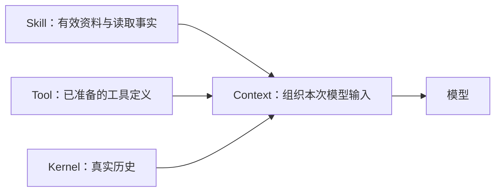

# Skill、Tool 与 Context：发现、读取与请求资料

本 PR 将 Skill 统一为可发现、可按需读取的方法资料，并按职责分工：**Skill 管来源、选择与读取事实，Tool 管工具曝光、调用与权限，Context 管主 Agent 下一次模型输入中的正文位置、可见范围和预算，Kernel 管执行顺序与真实历史。** 目录名称和简介仍由 `SkillLoader.get_skills_metadata_prompt` 生成，经 CLI/ACP 现有 system 模板插入；Context 组装主请求中的读取正文和宿主资料。子任务明确委派的方法资料包仍由子任务入口组装，见第 7 节。因此当前不是所有 Skill 相关拼装都已统一到 Context。正文不再因固定名称或关键词命中而自动写入 system。

本文说明当前源码的实现与兼容边界，不代表已发布或安装的运行时。测试入口列在文末；具体执行结果、目标提交和真实任务验证由本 PR 的最终验证报告分别记录。[Tool 重构文档](tool-refactor/design.md)保留其历史上下文，Skill 的当前行为以本文和源码为准。

## 1. 概念与职责

| 概念 | 当前含义 | 不代表什么 |
| --- | --- | --- |
| 目录 | 已安装 Skill 的名称、简介、来源、可用状态和分页信息 | 模型已经读过正文 |
| 显式选择 | slash、ACP 选择字段或公开宿主 API 提供的 Skill 名称 | 关键词匹配，也不授予工具或文件权限 |
| 读取事实 | 会话中核实过的来源、路径、正文版本、交付范围与顺序 | 该正文仍在下一次模型输入中 |
| 当前可见 | 真实消息或本轮宿主资料投影中保留的同源、同版、完整范围 | 摘要、成功回执或历史 loaded 标志 |
| 正文版本 | 渲染后 Skill 正文的 SHA-256；分页使用 `revision` | `SKILL.md` 原始文件摘要或目录版本 |
| 宿主资料快照 | 原生 Session Log 按内容 hash 保存；第三方 Store 可在既有请求记录中保存有界正文和 hash | 第二套会话日志或新的用户请求 |
| required 依赖 | 采用相关方法步骤前需要读取的方法 | 自动执行、自动安装或新增 `required_tools` |

`SkillLoader` 负责有序来源扫描、格式、目录刷新和可用性。`SkillRuntime.resolve_reference` 校验来源并返回不可变正文快照；`SkillSessionState` 保存选择与读取事实。`SkillRuntime` 不保存 `Message` 列表、请求预算或当前可见范围，也不再提供 `prepare_context`。`resolve_required_skills` 是主入口与子 Agent 共用的递归有效性校验。

| 处理 | 放在哪里 | 这样分工的收益与代价 |
| --- | --- | --- |
| Skill 扫描、来源优先级、禁用和 required 校验、正文版本、选择与读取事实 | Skill Engine | 主任务和 child 共用来源规则；Context 读取前需要向 Skill 取得有效快照。若放入 Context，恢复与独立读取也会依赖模型请求。 |
| 目录名称和简介的生成与插入 | SkillLoader 生成，CLI/ACP 现有 system 模板插入 | 保留发现入口，不等于读过正文；Context 接收包含这部分内容的完整消息并核算总量，不重新生成目录简介。 |
| 正文进入哪个普通消息、当前真实文本覆盖、复用、整组选择与分页预算 | Context Engine 的 `SkillReferenceContext` | 每次按实际输入重新核算，压缩后不会误用“已读”状态；需要读取 Skill 快照并回报交付事实。若留在 Skill，Skill 就必须同时掌握消息和工具开销。 |
| 工具目录、schema、曝光与调用目标、参数校验、权限和执行 | Tool Engine 与原权限入口 | 模型看到的工具与执行时解析的目标保持一致，每次执行仍检查权限；Context 接收完整工具集合。若 Context 自行删 schema 或重绑目标，会产生两套工具决定。 |
| 已准备工具的 schema 开销、资料和临时消息的总输入开销 | Context Engine | 同一次请求统一分配资料预算；预算不足由正文分页或提示处理，不改变工具集合。 |
| 请求与工具调用顺序、真实 assistant/tool 消息、持久记录和 flush | Kernel 经现有 Store 接口执行 | 请求副本与真实历史分开；Context 返回资料投影及关联信息，不能自行补造调用或替换历史。 |

这里的 Context 是输入处理职责，不要求一次搬完所有旧上下文代码。`context_input.py` 的 `DefaultContextEngine` 承接本次请求装配，`skill_context.py` 的 `SkillReferenceContext` 处理 Skill 资料；既有压缩与通用预算 helper 仍按原调用关系工作。

例如，用户选中了一个较长的 `review` Skill：

1. Skill 提供当前有效正文，Tool Engine 准备本次可用工具。
2. Context 发现正文放不下，且本次有允许读取该 Skill 的真实分页工具，便在当前 user 请求副本中放入名称与分页提示，保留工具定义。
3. 模型实际调用 `get_skill` 后，Context 交付预算内的一页，Skill 记录交付事实，Kernel 写入真实调用和 tool 消息。
4. 下一次请求仍由 Context 检查正文是否存在。若正文已被压缩移走，就提示重新读取，不因历史上“已读”而跳过。

宿主代读不补造 assistant tool call、tool response 或用户要求；资料也不会因为被读取而执行其中的脚本。

## 2. 先发现，再读取

默认路径移除了固定 Skill 全文预加载，也移除了目录中按特殊名称写死的 always-on 特例。CLI、ACP 仍通过 `SkillSelector` 匹配目录，并调用 `SkillLoader.get_skills_metadata_prompt` 生成有界的名称、简介等元数据，再插入既有 system 模板的 Skill 位置。这部分没有搬到 Context；目录字段作为发现数据处理，不是作者指令或权限。匹配结果不加入显式选择集合，问候或普通主题匹配不会交付全文。

`list_skills(query="", offset=0, limit=20)` 查询完整本地目录，`limit` 上限为 50。它在完整目录中搜索后分页，不沿用自动推荐候选的 top16 截断。空查询可遍历有效目录；精确查询不可用名称时返回诊断。目录版本覆盖简介、来源、状态等元数据变化，正文变化本身不要求目录版本变化。调用方发现目录版本改变后应从第一页重新读取。

`list_skills` 不调用远端 SkillHub。`get_skill(skill_name)` 保留旧调用形式与 `skill_view` 执行别名，增加 `offset`、`limit`、`revision`。两者在启用 Skill 的主任务工具集合中直接可见；远端搜索和安装仍通过原 SkillHub 工具及原确认路径。

读取时共用 Loader 的来源优先级、全局禁用、损坏、平台与 required 依赖检查。循环、缺失或不可用的 required 依赖返回诊断，不先交付 parent 正文。主会话返回 required/related 名称，由模型继续读取；不会递归塞入全部依赖正文。脚本、模板及其他资源继续使用原有 `read_file`、执行工具和权限机制。

## 3. 正文进入普通上下文

真实 `get_skill` 的正文保留在对应的 tool 消息中，`ToolResult.model_context` 明确提供模型应看到的有界正文或页面。它不再经由 `skill_result_adapter.py` 升为 system；不再使用的适配器已删除。通用结果存储不能把这份已经分配预算的 Skill 正文再次替换成短预览。

采用 Skill 后，模型应在用户要求和现有权限范围内，遵循适用的方法步骤、必需参考文件与验证。必需步骤受阻时，应使用可用且获准的恢复方式，或明确报告未完成，不能把阻塞步骤改称可选。该通用规则由 `SKILL_USAGE_GUIDANCE` 同时进入目录提示和 `get_skill` 描述；Skill 作者正文仍留在普通资料中，不因此变成 system 指令或授予工具权限。

用户显式选择由 `DefaultContextEngine.prepare_request` 调用 `SkillReferenceContext.prepare_request`，在当前 user 消息的**请求副本**中追加独立资料块。块中说明它是方法参考资料，不是新用户事实或权限。`Agent.messages` 中的原始用户文字及持久历史不因此改写，也不出现伪造的调用配对。

当前轮选中的资料在该轮每一次模型请求中重新计算投影。同源同版本全文已经完整保留在真实 tool 历史中时复用该处，不重复追加正文。CLI、ACP 在新用户轮次更新选择；会话读取事实继续保留。旧公开 `activate_skill_instructions` API 仍可调用，含义改为注册普通宿主资料，`set_system_prompt` 不再承担 Skill 正文拼装。

## 4. 预算、整组选择与分页

Context 的预算面向下一次完整模型请求：包括已有消息、工具 schema、当前调用参数、待提交的 tool 消息结构、请求资料及临时多模态内容，并预留输出空间。Tool Engine 先准备本次 `PreparedTools`，Kernel 将同一对象传给 `DefaultContextEngine.prepare_request`；Context 保留其 definitions、曝光和可调用目标绑定，只计算开销，不重建或删减工具集合。展示 schema 不代表授权，权限仍在每次 Tool 执行时检查。同批多个 Skill 读取共用剩余额度，每次调用按最新消息重新计算，不能各自占满一次总预算。

`reference_cost` 同时考虑字符数与 UTF-8 字节数，避免中文等多字节正文低估成本。资料页的外壳、元信息、短复用回执也计入预算。宿主资料使用 `projection_cost` 比较追加前后的最终 `Message`，计入正文转义、文本块包装及原字符串转为消息块的增量，不只计算原始资料文字。`PreparedContext.input_tokens` 记录请求资料的估算开销；内部 assistant 消息上的 `request_only_input_tokens` 让后续上下文估算扣回这部分非持久输入，避免下一页预算重复计数。

宿主多选先检查整个资料包。预算内的完整资料包可直接交付，即使本次没有读取工具。若全部选中正文不能共同放入请求，只有本次 `PreparedTools` 中存在真实、已曝光且可调用的 `GetSkillTool`，并且其允许范围和 profile 限制支持读取整组选中名称，才**整组改为名称与读取提示，使用 `get_skill` 逐页读取**。同名工具或仅有 schema 不足以证明分页能力；每次真实调用仍走权限检查。不会先固定放入短 Skill，让长 Skill 的后续页持续没有空间。

当前真实 tool 消息中已经完整可见的正文可参与复用，不重复占用宿主投影预算。没有适用的分页 reader，或剩余预算连显式选择的分页提示都放不下时，Context 返回 `PreparedContext.blocked_reason`，Kernel 在 provider 调用前发出 Error/Done 并结束该次 run，不静默丢掉用户选择。

分页以零起始行号定位，结果包含 `revision`、`offset`、`end_offset`、`total_lines`、`next_offset`、`has_more` 和 `complete`。页面保持完整行，`complete` 与已核实的可见范围共同计算。剩余预算连下一完整行都放不下时返回明确错误，不交付截断半行、不生成不前进的下一页位置。跨版本分页要求从新版本重新开始。

## 5. 会话事实与当前可见性

Agent 持有一个 `SkillRuntime`，每次 run 借用同一服务。共享 Loader 的不同 Agent 仍各自保存选择和已交付范围。Context 按 run 创建，当前可见范围和剩余预算在每次请求重新计算，不随 Skill 会话事实共享。直接 core 调用没有 Agent 持有者时，默认装配创建本次 Skill 服务；Context 的 `bind_history` 在进入循环、可能发生压缩之前，从传入的真实 tool 消息中核实并回报读取事实。

可见性检查比对名称、来源、路径、版本、行范围与准确正文。摘要和“已读取”回执不算全文可见。压缩移走正文后，保留来源和再读取信息；需要时允许重新调用 `get_skill`，不把过去的完整读取状态当成永久命中。

正文更新、来源变化或禁用后，历史消息仍作为历史事实保存，当前请求提供变更或不可用说明，旧正文不再被视为有效方法。工具 schema 提示所需的有效名称也从会话服务读取；目录曝光本身不会触发该提示或注册新动作。

## 6. 持久化与恢复兼容

原生 `SessionLog` 下，Context 将成功交付的宿主正文资料块交给 `store_skill_reference`，按内容 SHA-256 存入当前 session 的 `skill-references/`，返回 `contentRef`、hash、名称、版本、消息位置和范围。Kernel 将这些信息关联到既有 `request/context.skillReferences`，flush 完成后才调用 provider。重复内容复用快照；损坏、路径逃逸、符号链接及写入/fsync 失败均不能返回持久化成功。

`SessionStorePort` 不新增快照文件接口。第三方 Store 没有 `store_skill_reference` 时，Context 返回预算内的 `inlineContent` 和 `sha256`，由 Kernel 写入同一个既有 `request/context` 记录并 flush。这样保留实际交付内容，又不要求插件实现原生文件布局；代价是该条请求记录包含正文。两条路径都不新增事件类型，也不增加会话状态来源。

原生快照保存实际交付的资料块。关闭诊断 trace 或原 Skill 文件随后被删除，仍可用 `read_skill_reference` 校验并重建当时的资料内容；这不表示已经删除或禁用的来源可以继续作为当前方法执行。Session Log 仍是唯一持久会话来源，CLI 没有因此新增一套持久会话产品。

旧 `skill/change` 的 `name`、`sha256`、`loadOrder` 保持原含义，新来源、路径、原因、交付范围等字段只作增量扩展。Agent 在有 Loader 的构造恢复入口统一核对顺序、来源与版本，并采用**当前有效 Skill**。版本或来源与历史记录不同不阻断升级恢复，而是在普通资料中明确说明差异；新正文不得使用旧 hash 伪装成历史版本，原日志也不改写。只有当前来源缺失、禁用、损坏或 required 依赖校验失败才阻断恢复，失败不覆盖已有有效状态。恢复本身不制造新的工具加载事件。新日志继续使用旧读者认识的事件类型。

若历史中有 Skill 记录而当前没有来源，Agent 构造时暂存待恢复记录，允许调用方随后通过旧 `restore_active_skill_instructions` tuple API 提供当前正文。若执行开始时仍无法恢复，`run_events` 在模型调用和本次日志写入之前阻断，不能丢弃历史 Skill 后继续。ACP 没有这一步后补 tuple 的入口，因此在 `SessionLog.prepare_resume` 修复日志之前先校验来源；未单独传入会话 Loader 时，回退到真实 Get/List 工具的 Loader，校验失败不改写原日志。

恢复有效资料后，首轮普通参考资料或有界再读提示让模型重新找到当前方法；版本变化不会被当成损坏会话。对于旧 system 中的 active Skill 后缀，只在它与已核实旧记录正文构成的后缀逐字一致时，从**请求投影**中移除；不会按标题猜测和删除任意调用方 system 内容，原持久消息也不被重写。这保留 `main` 在 `8702f84` 引入的升级恢复行为，不恢复“历史 hash 不同即拒绝会话”的旧策略。

## 7. 子 Agent 的明确委派

子任务继续使用原平面参数与严格 `required_tools` 合同。`sub_agent_tool.py` 的 `_explicit_messages` 将任务和明确委派的方法组装成子任务输入，`_bounded_explicit_messages` 检查整体预算；这部分仍在子任务入口，没有迁入 `DefaultContextEngine`。明确分配的 Skill 展开 required 闭包，全文由 child system 移至子任务 user 参考资料；没有读取工具的 child 仍可获得预算内的完整明确资料包。此路径不属于关键词触发的自动预加载，也不增加工具授权。

已授予 child 的 Get/List 使用独立实例，只允许分配闭包中的名称，保留父任务实际的 profile 禁止项与用户显式例外。代读正文同样检查这些限制，不能绕过禁用策略。子 Agent 不对任意父 system 文本按 Skill 标题做粗切割；正常 Agent 提供无 Skill 正文的 system。

普通 child 资料超预算时，有获准的 `get_skill`/`read_file` 才能改为清单并按页读取；没有读取能力则在模型启动前失败。`batch_files` 是宿主预取后一次无工具的综合调用，不能把其 `read_file` grant 当成模型分页能力；追加文件正文后还会检查总请求量。错误返回可解释的能力或预算诊断，不以截断资料启动任务。

## 8. 插件、宿主与后续边界

外层 composition 经现有静态插件注册表提供 `SkillEnginePort`、`ContextEnginePort` 和 Store。默认 `DefaultContextEngine` 使用现有 plugin factory 按 run 创建；插件替换完成、最终工具目录与 Skill 来源校验通过后，才以 `configure_run` 借用最终 Skill Engine 和 Store。Kernel 接收 `PreparedContextPort` 描述的请求消息、资料关联、开销与阻断原因，不导入 `SkillRuntime`、Loader 或正文解析实现。

Agent、默认装配和 ACP 的来源回退共用 `skill_loader_from_catalog`，只从真实 `GetSkillTool` / `ListSkillsTool` 实例推断来源；其他工具即使带有 `skill_loader` 属性，也不会成为 Skill 来源。内置工具的 Loader 与 Skill 服务的 Loader 不一致时，外层装配明确拒绝。插件替换来源应成对替换工具目录和 Skill reader，不能悄悄搬迁已有会话事实。后续真实 `get_skill` 通过 Context 提供的 `tool_reader` 读取有界正文，调用与权限仍经过原 Tool Engine。

这里选择**集中连接依赖，各模块处理自己的业务**。若由 Skill、Tool 或 Kernel 在内部各自创建 Context，局部代码容易直接调用，但插件替换后的 Skill/Store 可能与 Context 持有的实例不同，预算与状态也容易重复。集中装配把创建、替换和来源核对放在一次启动流程中，能保证 Context 借用最终实例；代价是装配层要明确传递依赖并测试替换关系。现有 PluginHost 已支持这一流程，因此无需新增注册系统，也不把 Skill 或 Tool 的全部处理搬进 Context。

fast profile 的显式例外只来自用户选择，全局禁用不会因此解除。研究预算、浏览器/视频环境检查、SkillHub 安装确认沿用已有宿主策略。ACP 的正文交付事实、真实工具调用和执行用量仍分别记录：`skills_usage` 可标记 `activationSource: explicit`，而计费用 `skillInvocations.activationSource` 中的旧 `preloaded` / `get_skill` 枚举有意保留。`preloaded` 在此兼容字段中表示已交付的显式宿主资料，不表示固定全文预加载恢复；未交付成功的选择不伪报成功调用，主方法/依赖归因继续保留。

Tool 默认引擎的创建、注册与释放装配是独立后续工作，不承担补齐本 PR 的 Skill 能力。`create_scheduled_task` 的 schema、确认、host bridge 与 standalone 行为不在本次变更范围。旧 `tools/skill_preload.py` 及共享 helper 中仍有离线兼容 API；它们不再进入默认自动全文路径。

## 9. 源码与验证入口

| 边界 | 主要源码 | 现有测试文件 |
| --- | --- | --- |
| 本地发现、来源刷新、禁用、目录提示与通用使用规则 | `tools/skill_loader.py`、`tools/skill_catalog_tool.py`、`tools/skill_tool.py` | `tests/test_skill_loader.py`、`test_skill_filter.py`、`test_skill_catalog_tool.py`、`test_skill_usage_guidance.py` |
| Skill 来源快照、选择与已交付事实 | `skill_runtime.py`、`skill_state.py`、`tools/skill_tool.py` | `tests/test_skill_tool.py`、`test_context_input.py`、`test_skill_context_regressions.py` |
| Context 请求装配、真实读取覆盖、资料预算与分页能力 | `context_input.py`、`skill_context.py`、`kernel/context_engine.py` | `tests/test_context_input.py`、`test_skill_context.py`、`test_skill_context_regressions.py`、`test_skill_entry_boundaries.py`、`test_tool_result_storage.py` |
| Agent 借用、真实工具来源、公开兼容 API 与恢复 | `agent.py`、`agent_service.py`、`session_log.py`、`acp/__init__.py` | `tests/test_agent_run_options.py`、`test_agent_session_persistence.py`、`test_skill_entry_boundaries.py`、`test_skill_reference_persistence.py` |
| CLI/ACP 选择、profile、预算与用量归因 | `cli.py`、`acp/__init__.py`、`tools/local_tool_exposure.py` | `tests/test_skill_preload.py`、`test_skill_prompt_layout.py`、`test_acp.py`、`test_local_tool_search.py` |
| required 闭包、child 正文角色和能力限制 | `skill_dependencies.py`、`tools/sub_agent_capabilities.py`、`tools/sub_agent_tool.py` | `tests/test_sub_agent_capabilities.py`、`test_sub_agent_tool.py` |
| 默认来源与 Context 依赖绑定、Port 与插件替换 | `composition.py`、`plugins/defaults.py`、`kernel/ports.py` | `tests/test_skill_plugin_composition.py`、`test_plugin_host.py`、`test_context_input.py`、`test_architecture_boundaries.py` |
| 保留的外部能力合同 | SkillHub、调度工具与宿主适配 | `tests/test_skillhub_search_tool.py`、`test_skillhub_install_tool.py`、`test_schedule_tool.py`、`test_schedule_tool_contract.py` |

`test_agent_session_persistence.py` 包含新日志由 PR1 固定提交 `3e83bb3b287e244dd1a2887fd4bc14be2eb19e32` 的旧读取器投影的独立子进程检查。默认直接用 `git show` 从该提交提取原 `session_log.py` 和 schema，不依赖个人的邻接 checkout；也可通过 `BOX_AGENT_LEGACY_WORKTREE` 指向该固定提交的 checkout。只有未指定路径且旧 Git 对象不可用时（例如 shallow clone）才跳过；指定路径则会核对 HEAD。验证报告应单独说明跳过，不能把它算成跨版本通过。

整体原则是：谁掌握做决定所需的信息，谁负责该决定。来源和依赖归 Skill，是否能执行归 Tool 与权限入口，完整输入能否容纳、当前正文是否存在归 Context；Kernel 保存真实顺序和历史，模型协议序列化仍归 LLM 适配器。这次改动覆盖所需的职责拆分与依赖连接；原 Skill 文件、Tool 权限以及 scheduled task 行为不在变更范围。以上是源码边界与验证入口，最终测试、打包和真实任务结果仍需按各自证据报告。
