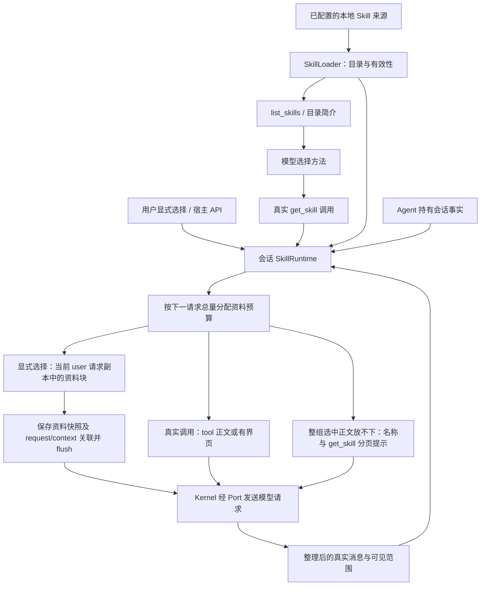

# Skill Engine：发现、读取与会话资料

本 PR 将 Skill 统一为可发现、可按需读取的方法资料。目录提供名称、简介与可用性；正文通过真实 `get_skill` 结果或宿主选择后的普通资料块交付，不再因固定名称或关键词命中而自动写入 system。Agent 保存会话读取事实，Kernel 只接收能力接口与本次请求的资料投影。

本文说明当前源码的实现与兼容边界，不代表已发布或安装的运行时。测试入口列在文末；具体执行结果、目标提交和真实任务验证由本 PR 的最终验证报告分别记录。[Tool 重构文档](tool-refactor/design.md)保留其历史上下文，Skill 的当前行为以本文和源码为准。

## 1. 概念与职责

| 概念 | 当前含义 | 不代表什么 |
| --- | --- | --- |
| 目录 | 已安装 Skill 的名称、简介、来源、可用状态和分页信息 | 模型已经读过正文 |
| 显式选择 | slash、ACP 选择字段或公开宿主 API 提供的 Skill 名称 | 关键词匹配，也不授予工具或文件权限 |
| 读取事实 | 会话中核实过的来源、路径、正文版本、交付范围与顺序 | 该正文仍在下一次模型输入中 |
| 当前可见 | 真实消息或本轮宿主资料投影中保留的同源、同版、完整范围 | 摘要、成功回执或历史 loaded 标志 |
| 正文版本 | 渲染后 Skill 正文的 SHA-256；分页使用 `revision` | `SKILL.md` 原始文件摘要或目录版本 |
| 宿主资料快照 | Session Log 目录下按内容 hash 保存的不可变资料块 | 第二套会话日志或新的用户请求 |
| required 依赖 | 采用相关方法步骤前需要读取的方法 | 自动执行、自动安装或新增 `required_tools` |

`SkillLoader` 负责有序来源扫描、格式、目录刷新和可用性；`SkillRuntime` 负责会话读取与投影；`SkillSessionState` 保存事实；`skill_context.py` 渲染普通资料并核对真实可见范围。`resolve_required_skills` 是主入口与子 Agent 共用的递归有效性校验，不新增依赖求解框架。

图中的工具调用必须真实发生。宿主代读不补造 assistant tool call、tool response 或用户要求；资料也不会因为被读取而执行其中的脚本。

## 2. 先发现，再读取

默认路径移除了固定 Skill 全文预加载，也移除了目录中按特殊名称写死的 always-on 特例。CLI、ACP 的匹配仍可更新目录简介，但匹配结果不加入显式选择集合，问候或普通主题匹配不会交付全文。

`list_skills(query="", offset=0, limit=20)` 查询完整本地目录，`limit` 上限为 50。它在完整目录中搜索后分页，不沿用自动推荐候选的 top16 截断。空查询可遍历有效目录；精确查询不可用名称时返回诊断。目录版本覆盖简介、来源、状态等元数据变化，正文变化本身不要求目录版本变化。调用方发现目录版本改变后应从第一页重新读取。

`list_skills` 不调用远端 SkillHub。`get_skill(skill_name)` 保留旧调用形式与 `skill_view` 执行别名，增加 `offset`、`limit`、`revision`。两者在启用 Skill 的主任务工具集合中直接可见；远端搜索和安装仍通过原 SkillHub 工具及原确认路径。

读取时共用 Loader 的来源优先级、全局禁用、损坏、平台与 required 依赖检查。循环、缺失或不可用的 required 依赖返回诊断，不先交付 parent 正文。主会话返回 required/related 名称，由模型继续读取；不会递归塞入全部依赖正文。脚本、模板及其他资源继续使用原有 `read_file`、执行工具和权限机制。

## 3. 正文进入普通上下文

真实 `get_skill` 的正文保留在对应的 tool 消息中，`ToolResult.model_context` 明确提供模型应看到的有界正文或页面。它不再经由 `skill_result_adapter.py` 升为 system；该死适配器已删除。通用结果存储不能把这份已经分配预算的 Skill 正文再次替换成短预览。

用户显式选择由 `SkillRuntime.prepare_context` 在当前 user 消息的**请求副本**中追加独立资料块。块中说明它是方法参考资料，不是新用户事实或权限。`Agent.messages` 中的原始用户文字及持久历史不因此改写，也不出现伪造的调用配对。

当前轮选中的资料在该轮每一次模型请求中重新计算投影。同源同版本全文已经完整保留在真实 tool 历史中时复用该处，不重复追加正文。CLI、ACP 在新用户轮次更新选择；会话读取事实继续保留。旧公开 `activate_skill_instructions` API 仍可调用，含义改为注册普通宿主资料，`set_system_prompt` 不再承担 Skill 正文拼装。

## 4. 预算、整组选择与分页

预算面向下一次完整模型请求：包括已有消息、工具 schema、当前调用参数、待提交的 tool 消息结构、请求资料及临时多模态内容，并预留输出空间。同批多个 Skill 读取共用剩余额度，每次调用按最新消息重新计算，不能各自占满一次总预算。

`reference_cost` 同时考虑字符数与 UTF-8 字节数，避免中文等多字节正文低估成本。资料页的外壳、元信息、短复用回执也计入预算。`SkillContext.input_tokens` 记录请求资料的估算开销；内部 assistant 消息上的 `request_only_input_tokens` 让后续上下文估算扣回这部分非持久输入，避免下一页预算重复计数。

宿主多选先检查整个资料包。若全部选中正文不能共同放入本次请求，**整组改为名称与读取提示，使用 `get_skill` 逐页读取**；不会先固定放入短 Skill，让长 Skill 的后续页持续没有空间。当前真实 tool 消息中已经完整可见的正文可参与复用，不重复占用宿主投影预算。

分页以零起始行号定位，结果包含 `revision`、`offset`、`end_offset`、`total_lines`、`next_offset`、`has_more` 和 `complete`。页面保持完整行，`complete` 与已核实的可见范围共同计算。剩余预算连下一完整行都放不下时返回明确错误，不交付截断半行、不生成不前进的下一页位置。跨版本分页要求从新版本重新开始。

## 5. 会话事实与当前可见性

Agent 持有一个 `SkillRuntime`，每次 run 借用同一服务。共享 Loader 的不同 Agent 仍各自保存选择、读取范围和剩余预算。直接 core 调用没有 Agent 持有者时，默认装配创建本次服务，并在进入 Kernel、可能发生压缩之前，从传入的真实 tool 消息中核实读取事实。

可见性检查比对名称、来源、路径、版本、行范围与准确正文。摘要和“已读取”回执不算全文可见。压缩移走正文后，保留来源和再读取信息；需要时允许重新调用 `get_skill`，不把过去的完整读取状态当成永久命中。

正文更新、来源变化或禁用后，历史消息仍作为历史事实保存，当前请求提供变更或不可用说明，旧正文不再被视为有效方法。工具 schema 提示所需的有效名称也从会话服务读取；目录曝光本身不会触发该提示或注册新动作。

## 6. 持久化与恢复兼容

成功交付的宿主正文资料块先调用 `SessionLog.store_skill_reference`，按内容 SHA-256 存入当前 session 的 `skill-references/`，再把 `contentRef`、hash、名称、版本、消息位置和范围关联到既有 `request/context.skillReferences`。关联 flush 完成后才调用 provider。重复内容复用快照；损坏、路径逃逸、符号链接及写入/fsync 失败均不能返回持久化成功。

快照保存实际交付的资料块。关闭诊断 trace 或原 Skill 文件随后被删除，仍可用 `read_skill_reference` 校验并重建当时的资料内容；这不表示已经删除或禁用的来源可以继续作为当前方法执行。Session Log 仍是唯一持久会话来源，CLI 没有因此新增一套持久会话产品。

旧 `skill/change` 的 `name`、`sha256`、`loadOrder` 保持原含义，新来源、路径、原因、交付范围等字段只作增量扩展。Agent 在有 Loader 的构造恢复入口统一核对顺序、来源与版本，并采用**当前有效 Skill**。版本或来源与历史记录不同不阻断升级恢复，而是在普通资料中明确说明差异；新正文不得使用旧 hash 伪装成历史版本，原日志也不改写。只有当前来源缺失、禁用、损坏或 required 依赖校验失败才阻断恢复，失败不覆盖已有有效状态。旧 tuple 恢复 API 仍支持，恢复本身不制造新的工具加载事件。新日志继续使用旧读者认识的事件类型。

恢复有效资料后，首轮普通参考资料或有界再读提示让模型重新找到当前方法；版本变化不会被当成损坏会话。对于旧 system 中的 active Skill 后缀，只在它与已核实旧记录正文构成的后缀逐字一致时，从**请求投影**中移除；不会按标题猜测和删除任意调用方 system 内容，原持久消息也不被重写。这保留 `main` 在 `8702f84` 引入的升级恢复行为，不恢复“历史 hash 不同即拒绝会话”的旧策略。

## 7. 子 Agent 的明确委派

子任务继续使用原平面参数与严格 `required_tools` 合同。明确分配的 Skill 展开 required 闭包，全文由 child system 移至子任务 user 参考资料；没有读取工具的 child 仍可获得预算内的完整明确资料包。此路径不属于关键词触发的自动预加载，也不增加工具授权。

已授予 child 的 Get/List 使用独立实例，只允许分配闭包中的名称，保留父任务实际的 profile 禁止项与用户显式例外。代读正文同样检查这些限制，不能绕过禁用策略。子 Agent 不对任意父 system 文本按 Skill 标题做粗切割；正常 Agent 提供无 Skill 正文的 system。

普通 child 资料超预算时，有获准的 `get_skill`/`read_file` 才能改为清单并按页读取；没有读取能力则在模型启动前失败。`batch_files` 是宿主预取后一次无工具的综合调用，不能把其 `read_file` grant 当成模型分页能力；追加文件正文后还会检查总请求量。错误返回可解释的能力或预算诊断，不以截断资料启动任务。

## 8. 插件、宿主与后续边界

外层 composition 经静态插件注册表向 Kernel 提供 `SkillEnginePort`。`SkillContextPort` 只声明 `messages`、`references`、`input_tokens`；Kernel 不导入 `SkillRuntime`、Loader 或正文解析实现。默认推断只识别真实 Get/List；内置工具的 Loader 与借用 reader 的 Loader 不一致时，外层装配明确拒绝。插件替换来源应成对替换工具目录和 reader，不能悄悄搬迁已有会话事实。

fast profile 的显式例外只来自用户选择，全局禁用不会因此解除。研究预算、浏览器/视频环境检查、SkillHub 安装确认沿用已有宿主策略。ACP 的正文交付事实、真实工具调用和执行用量仍分别记录：`skills_usage` 可标记 `activationSource: explicit`，而计费用 `skillInvocations.activationSource` 中的旧 `preloaded` / `get_skill` 枚举有意保留。`preloaded` 在此兼容字段中表示已交付的显式宿主资料，不表示固定全文预加载恢复；未交付成功的选择不伪报成功调用，主方法/依赖归因继续保留。

Tool 默认引擎的创建、注册与释放装配是独立后续工作，不承担补齐本 PR 的 Skill 能力。`create_scheduled_task` 的 schema、确认、host bridge 与 standalone 行为不在本次变更范围。旧 `skill_preload.py` 及共享 helper 中仍有离线兼容 API；它们不再进入默认自动全文路径。

## 9. 源码与验证入口

| 边界 | 主要源码 | 现有测试文件 |
| --- | --- | --- |
| 本地发现、来源刷新、禁用与分页目录 | `tools/skill_loader.py`、`tools/skill_catalog_tool.py` | `tests/test_skill_loader.py`、`test_skill_filter.py`、`test_skill_catalog_tool.py` |
| 真实读取、引用格式、预算与可见性 | `skill_runtime.py`、`skill_context.py`、`skill_state.py`、`tools/skill_tool.py` | `tests/test_skill_tool.py`、`test_skill_context.py`、`test_skill_context_regressions.py`、`test_tool_result_storage.py` |
| Agent 借用、公开兼容 API 与恢复 | `agent.py`、`session_log.py` | `tests/test_agent_run_options.py`、`test_agent_session_persistence.py`、`test_skill_reference_persistence.py` |
| CLI/ACP 选择、profile、预算与用量归因 | `cli.py`、`acp/__init__.py`、`tools/local_tool_exposure.py` | `tests/test_skill_preload.py`、`test_skill_prompt_layout.py`、`test_acp.py`、`test_local_tool_search.py` |
| required 闭包、child 正文角色和能力限制 | `skill_dependencies.py`、`tools/sub_agent_capabilities.py`、`sub_agent_tool.py` | `tests/test_sub_agent_capabilities.py`、`test_sub_agent_tool.py` |
| 默认来源绑定、Port 与插件替换 | `composition.py`、`plugins/defaults.py`、`kernel/ports.py` | `tests/test_skill_plugin_composition.py`、`test_plugin_host.py`、`test_architecture_boundaries.py` |
| 保留的外部能力合同 | SkillHub、调度工具与宿主适配 | `tests/test_skillhub_search_tool.py`、`test_skillhub_install_tool.py`、`test_schedule_tool.py`、`test_schedule_tool_contract.py` |

`test_agent_session_persistence.py` 包含新日志由 PR1 `3e83bb3` 读取器投影的独立子进程检查；其他环境可通过 `BOX_AGENT_LEGACY_WORKTREE` 指定原 checkout。不存在该 checkout 时该项会跳过，验证报告应单独说明，不能把跳过算成跨版本通过。
