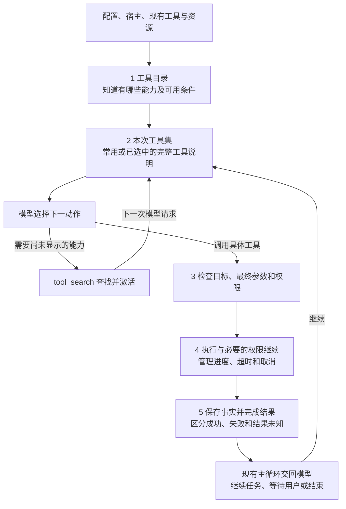

# Box-Agent Tool 整体设计与第一阶段重构方案

日期：2026-09-08。状态：已批准，正在实施。**Tool 阶段一个 PR，Skill 阶段另一个 PR；每阶段都要保留原任务能力。** 本文是 Tool 设计的主文档；文件迁移、既有测试和提交操作放在 [实施明细](implementation.md)。

源码依据：已逐项审阅的 2d06469，以及本轮拉取核对的最新 main **73cce3060dd708d50b0afff92b3f69acdeaf2d53**。两者之间的 PR112 只调整 managed stdio MCP 的 profile 传递、文档和测试，下面讨论的工具语义未变；实现必须继承该修复。

## 1. 整体设计：让模型找到合适的动作，并可靠地完成每次调用

### 1.1 这套系统究竟要解决什么

**Tool Engine 的目标，是让模型用合适的工具完成任务，并让每次调用都能回答：调用了谁、是否有权限、实际发生了什么、失败后能否再做。**

工具系统可以拥有很多能力，但没必要在每次请求时把全部说明都交给模型。模型应当直接看到常用动作，需要专门能力时能找到它；选中工具以后，程序必须使用与说明对应的实现，检查实际参数和权限，处理执行、取消及失败，最后如实返回结果。

因此，设计的重点有三项：

| 重点 | 必须解决的问题 | 怎样判断有效 |
| --- | --- | --- |
| **模型会用** | 工具意图清楚，集合够用，专门能力可以发现，不被大量无关说明干扰 | 原任务能完成；误选、参数错误、找工具轮数和说明成本可测 |
| **执行可靠** | 同一调用的目标、最终参数、权限、重试、取消一致 | 拒绝不被绕过；未知结果不盲目重做；进度与父调用不丢 |
| **变化可控** | 新工具、改名、撤掉入口都不需要到主循环到处补分支 | 变更有明确归属、影响表与兼容验证；原能力有可验证路径 |

把代码从 loop 搬到一个目录，是落实这些目标的手段，不能独立算作设计完成。

### 1.2 一次任务怎样运转

例如用户要求：“读取销售数据，查询行业资料，生成带图的报告。”这是解释设计的例子，不代表本次已执行。

1. 原 Skill 逻辑继续提供方法和资源。工具系统按当前宿主、配置和已有资源确定可提供的能力。
2. 文件操作等常用工具直接交给模型；搜索、图像等也可按当前任务场景直接提供。其余扩展通过简短目录说明让模型知道可以查找。
3. 若所需工具尚未显示，模型调用 tool_search；系统找到并激活具体工具，下次模型请求收到它的完整参数说明。
4. 模型调用具体工具。Engine 固定本次真实目标，完成参数与权限检查，再执行；批准后的继续仍走同一执行入口。
5. 结果成功则提供事实；失败则明确说明应改参数、补条件、查询原操作，还是可以安全再试。输出整理出错不能触发原动作重做。
6. 模型根据结果决定下一步；现有主循环组织往返，最后由模型结合实际产物交付。

**图 1 只画上述主线。** “工具目录”是程序知道的能力，“本次工具集”是这次发给模型的完整说明，两者不是同一份列表。



后文按这条主线展开：第 3 节决定有哪些工具，第 4 节决定什么时候给模型，第 5–6 节说明如何检查和执行，第 7 节说明结果，第 8–10 节说明怎样改代码并验证。

### 1.3 Tool Engine 与现有 tools 的关系

**整个子系统继续叫 `tools`；Tool Engine 是其中统一管理调用的部分。** 新建顶层 `box_agent/tool_engine` 没有必要，更不需要 Git submodule、独立仓库或独立进程。

| 名称 | 具体含义 | 代码归属 |
| --- | --- | --- |
| tools | 整个工具子系统 | `box_agent/tools/` |
| 具体 Tool | 完成某个动作，例如读取文件、执行命令 | 现有 `tools/file/`、`tools/bash_tool.py` 等 |
| Tool Engine | 统一目录、模型可见工具、执行和结果规则 | `tools/engine/` |
| 工具组（tool set） | 为某类场景组合的一组工具，例如文件、图像、任务管理 | 普通配置/策略数据，不是另一个模型必须调用的工具 |
| 原 Skill 实现 | 提供方法、脚本位置和加载状态 | 本阶段保留原 Loader、预加载与 Agent 状态 |
| kernel | 请求模型、接受用户输入、继续或结束对话 | 通过 ToolEnginePort 使用工具系统 |

依赖方向是：装配层把具体工具交给 Engine，主循环通过接口使用 Engine。普通工具只需遵守 Tool / ToolResult，不需要反向依赖完整 Engine。

## 2. 固定原则：实现时按什么裁决，避免越做越偏

下面按优先级排序。发生冲突时，高优先级优先；工具数和目录数量不是最高目标。

| 优先级 | 原则 | 实施时的具体裁决 | 验收证据 |
| --- | --- | --- | --- |
| P0 | **保留任务能力，遵守授权边界** | 改名、隐藏或删除入口必须有可用替代；不能用 bash 绕过另一工具的拒绝 | 原任务与拒绝场景回归，实际产物检查 |
| P1 | **说明与执行一致** | 模型按哪份定义调用，就绑定哪份真实对象；别名和发现不能偷换目标 | 请求定义、目标、参数与 MCP generation 对照 |
| P2 | **一条调用链，重做必须有依据** | 首次、权限继续和直接调用共用执行；超时不当作“没做过” | 副作用计数、批准后进度、取消与未知结果测试 |
| P3 | **执行事实与展示分开** | Hook、摘要、界面不能改写真实结果；输出处理失败不重跑动作 | 原结果、模型内容、日志和 UI 分别可核对 |
| P4 | **工具够用、易找、稳定** | 常用直接提供，低频扩展可发现；不机械追求四个或七个工具，不每轮大幅开关 | 任务成功、发现轮数、误选、schema 成本与缓存变化 |
| P5 | **删改有影响闭环，复杂度有实际收益** | 不按名字相似合并；每项改名/移除列调用方、替代、兼容与验收；不提前建设通用平台 | 迁移表逐项关闭；新增机制有明确消费方和测试 |

原设计中的“能力优先、注册与暴露分开、失败如实处理”继续有效。本轮不要求完整 Capability 版本体系、自动 Provider 求解、补偿事务或热卸载平台。

“保持名称不变”降为一种兼容手段。**可以改名、改工具集合、去掉不合理入口；不可以把这些变化造成的能力缺口留给 Skill 阶段补齐。**

## 3. 工具集合：先看动作语义，再决定保留、改名或撤下

### 3.1 一个模型工具应该表达什么

优先保持“一项明确动作、可解释参数、可观察结果”。拆分与合并看四件事：动作目的、输入输出、权限边界、副作用与重试语义。

例如 append_file 会向原文件追加内容，重复执行会重复追加；write_file 负责整文件替换或分块后原子提交。合成一个带许多 mode 的写工具会减少一个名字，却未必减少模型判断，也会混合不同重试规则。

同样，不能把 edit_file 改名为 apply_patch 就认为学到了 Codex：当前工具是精确字符串替换，patch 是另一种输入及冲突处理语义。

### 3.2 本 PR 的工具集合决策

下面是基于当前源码的具体建议，不是照抄其他 Agent 的名单。模型面移出常驻与删除能力分开记录。

| 当前工具/组 | 本 PR 决策 | 原因及保留条件 |
| --- | --- | --- |
| read_file、write_file、edit_file、search_files | 保留名称，作为有文件能力场景的基础工具 | 意图清楚，已有 read/write/edit 别名；没有只为换风格改名的收益 |
| bash | 本 PR 保留名称与 exec/terminal 兼容名 | 它在 Windows 也可执行 PowerShell；若以后改为 execute_command，应同时明确跨平台契约，不能只换名字 |
| append_file | 保留独立语义，普通会话可发现，文件生成场景可直接提供 | 非幂等追加与完整替换不同；已有 Skill 真实依赖 |
| query_jsonl | 保留，文件/数据场景直接提供，其余可发现 | 有流式扫描、投影、过滤、游标和输出边界；read_file 的引导必须能抵达它 |
| bash_output、bash_kill | 存在当前会话可访问句柄后提供，也可通过发现入口找到 | 已结束但输出未读的任务仍需要 output；执行时必须检查 owner，不靠隐藏保证隔离 |
| execute_code、inspect_images、generate_image | 按运行模式、模型能力、配置及任务场景提供 | 专门执行环境和多模态能力不能用“都能 shell”假设代替 |
| sandbox_status | 从普通常驻面撤下，保留诊断发现和 CLI 入口 | 状态诊断有用，但不是每轮任务的必需说明 |
| mcp_config | 从普通任务常驻面撤下，管理场景/相关 Skill 直接提供，其余可发现 | 现有 mcp-config、browser-use Skill 需要它；写配置不等于连接成功 |
| report_execution_result | 需要结构化执行回执的宿主流程直接提供，普通任务可发现 | 不能以自然语言 final 替代宿主需要的机器回执，也不能把模型报告当独立验证事实 |
| create_scheduled_task | **保持原名、原 schema 和常驻提供方式**，本 PR 不做名称迁移 | 仍只发送预填草稿，用户保存结果未知；原工具描述和 Skill 继续说明保存边界 |
| request_user_input、request_user_decision | 本 PR 保留两种语义和独立入口，交互场景按宿主支持直接提供 | 一个补缺失事实，一个给有限选项且可能有受限超时默认；合成一个入口会引入参数分支和宿主迁移，本次没有效果证据证明更简单 |
| plan_read/write、todo_read/write、goal_read/write | 保留不同状态语义，改变提供条件，见下节 | 方案审批、执行进度、跨轮持久目标不是同一状态 |
| memory、Obsidian、SkillHub、普通 MCP | 有相应能力时进入目录；按场景直接提供或搜索追加 | 保留各自权限和配置条件。SkillHub 实际模型名是 search_skillhub / install_skillhub_skill |
| get_skill、tool_search、sub_agent | 保留；tool_search 扩展到本地低频工具，sub_agent 仍按配置与父权限提供 | Skill 加载、能力发现、任务委派是不同动作，不能合成一个万能入口 |

当前默认并没有注册 staged_file_write；VisionReviewTool 已是 Python import 兼容别名，也不是额外暴露的一份模型 schema。不能把它们计作“这次删掉的冗余默认工具”。

**本次确定删除的，是普通模型面中无关的常驻说明；不新增重复 schema，也不未经验证删除底层能力。** 若实现中发现某入口的能力已由另一条路径完整覆盖，可以在同一 PR 的删改表中补充彻底移除，但必须先提供影响证据。不会为了显得重构彻底而预先凑删除数量。

### 3.3 plan、todo、goal 怎样避免同时干扰模型

| 组 | 实际用途 | 直接提供的条件 | 本 PR 不做的推断 |
| --- | --- | --- | --- |
| plan | 对用户发布方案，可作为审批边界 | 已有计划或待审批计划（含恢复），宿主要求方案/审批，或已加载的方法明确需要 | 不能完成 todo 就算方案获批 |
| todo | 跟踪执行步骤，支持原子推进 | 当前有进度状态，或任务场景/方法需要进度管理 | 不能完成清单就终止持久目标 |
| goal | 跨轮目标、证据、完成/阻塞与自动续跑 | 存在需查询/管理的目标（含恢复、暂停、阻塞或已完成），或用户明确管理目标 | 不能用一段进度摘要替代 goal/change 的恢复 |

没有相关状态也没有明确需求时，相关工具进入可发现集合。loop 因 require_plan_approval / force_plan 要求调用 plan_write 之前，该工具必须已直接提供，不能一边要求调用、一边隐藏。原三套状态在本 PR 不合并；Engine 只从原所有者读取提供条件。goal_read/write 当前确实是 Agent 默认注册的模型工具，不能在盘点时遗漏。

## 4. 暴露与加载：采用两档模型呈现，不做层层找工具

### 4.1 四个概念分开，才能讨论是否该“按需加载”

| 概念 | 通俗解释 | 不代表什么 |
| --- | --- | --- |
| 已登记 | 系统知道这项工具及如何取得实现 | 不代表应该给所有会话 |
| 当前可提供 | 配置、宿主、模型和来源条件允许提供 | 不代表某个文件/命令已经授权 |
| 本次模型可见 | 本次请求带了这项工具的完整说明 | 不代表执行可以跳过参数和权限检查 |
| 执行端就绪 | 所需连接、进程或环境可以工作 | 不代表模型本次看见了它 |

**本 PR 的按需机制重点是少发无关 schema。** 它不自动减少 Python import、MCP 连接或浏览器启动的成本。真正延迟初始化需先找到昂贵步骤，再为对应实现增加启动逻辑；本次保留当前加载时机和 PR112 的 managed MCP profile 传递，不另建全工具工厂平台。

### 4.2 推荐两档：直接提供，或者搜索后追加

直接提供包括：该场景的基础工具、宿主必需的交互、已有状态所需的工具、显式选定方法所需的工具。

**场景由谁决定：** 本 PR 只读取宿主 mode、显式配置、原状态所有者，以及已确认 Skill 的可信工具提示；每次请求准备时确定性合并。先按能力限制过滤，再将各来源的必要工具取并集。没有匹配模板时使用通用集合，其他允许能力仍可发现；不新增每轮语义分类器，也不凭模型一句话授予权限。

通用文件任务的起始组合可为 read_file、write_file、edit_file、search_files、bash，加上宿主支持的 request_user_input / request_user_decision、启用 Skill 时的 get_skill、有延迟工具时的 tool_search。这是场景模板，不是固定数量指标。有结构化交互能力时两种交互直接提供；没有卡片支持时沿用现有文本等待方式，不能隐藏 decision 后诱导模型误用 input。

低频本地工具、宿主集成与普通 MCP 则可搜索后追加。实现上扩展现有 tool_search，使它能在“本地低频工具 + 原 MCP 搜索结果”中查找；优先复用现有关键词与精确名称逻辑，不新增向量服务或模型分类器，也不另加 tool_describe/tool_call 通用桥。

**图 2 解释追加，不表示重新安装工具。** 搜索结果只激活真实工具，下一次请求照常使用原生工具调用。


### 4.3 防止“隐藏了就找不到”

1. 只要当前还有可发现工具，tool_search 就可用，即使 MCP 关闭也一样。旧 tool_search 目前只搜 MCP，这一扩展必须先实现，再撤下本地常驻工具。
2. 给模型一份短能力目录，说明能查找文件追加、诊断、集成等什么能力；不要把所有完整 schema 换成同样长的描述墙。
3. 接口保留 query / queries / tool_names / server_name / top_k。有 tool_names 时仍优先精确查找，不用模糊结果替代，也不受 top_k 截断；支持规范名与旧名。server_name 仍只限定对应 MCP 服务，不混入本地结果；未指定时可查两类来源。保留导航命中时配套 snapshot 工具（companion）的激活及既有计数字段语义，本地来源另行标明，不悄悄把 MCP 计数改成全部工具数。
4. 显式选定或已加载的 Skill 可通过可信的工具提示表提供必需工具；这张表归 tools，不要求重构 Skill Engine，不从任意 Markdown 自动推断权限。已审计的 PPT、browser-use、mcp-config 等原方法必须有完整可达路径。
5. 已知且允许披露的不可用工具可以说明禁用、缺环境或连接状态，但不能进入激活集合；未登记或不应披露的来源按无可用匹配处理。不得回退执行一个未向模型提供的同名工具。
6. 子 Agent 目录按父会话允许能力、显式委派要求和既有子 Agent 策略裁剪，发现只能在结果范围内发生。父模型本轮未显示某工具，不等于父会话禁止该能力；不能用本轮 schema 列表替代原 live tool map 而丢失委派能力。
7. 本地查找不等待 MCP ready。MCP 连接中时返回本地命中并独立标注 MCP loading；精确查本地名字不进入原最长 15 秒 MCP 等待。部分来源未就绪不等于全目录为空。
8. MCP 的名称保护取自会话允许的完整本地目录，包含尚未暴露工具的规范名和别名；不能隐藏 append_file 后让同名 MCP 顶替。既有 eager 的显式覆盖/恢复仍按原模式处理，不能把这一兼容规则误用于 deferred 抢占。

### 4.4 可见集合尽量稳定

本次请求保存定义、别名映射、真实对象和 MCP generation。返回调用后按这份数据执行；后续变化不静默替换目标。

会话内被主动激活的工具原则上保留，不因下一句话关键词不同就移出。后台任务首次出现时追加 output/kill，至少保留到相关可读输出/句柄不再需要；可以持续保留到会话结束来减少抖动。权限撤销、来源失效、MCP 重连则必须按实际条件失效，不能为了缓存保留可执行权限。

模型定义视图还要保留自定义 schema 输出和 MCP 来源元数据，否则缓存指纹与工具统计会变化。原模型请求、日志 header 与指纹使用同一份定义。

### 4.5 是否值得做，要看收益和代价

好处是少发低频 schema、减少无关候选；代价是多一次发现调用或模型往返、搜索误选、工具列表变化带来的缓存损失。常用文件/命令/交互不应一律先搜索。

验收比较：原任务成功与产物、工具误选/参数错误、发现次数/找不到比例、schema token、总输入与缓存、整体延迟。先设“原能力不能丢、权限不能放松”的硬约束，再判断节省是否覆盖额外往返；不承诺工具数降低就必然更快或更聪明。

## 5. 权限设计：对实际动作授权，不对工具名字授权

### 5.1 三层判断各司其职

| 层次 | 谁判断 | 例子 |
| --- | --- | --- |
| 会话能力范围 | 现有配置、宿主和子 Agent 能力裁剪 | 这个会话是否提供浏览器、外部集成或写工具 |
| 本次调用有效性 | Engine | 本次确实提供了哪个工具、别名对应谁、参数定义是否变化 |
| 最终资源与动作权限 | 现有 Permission/Workspace 和工具自身的具体检查 | 最终文件路径是否允许，命令是否需要批准，进程 owner 是否匹配 |

发现工具、加载 Skill、显示工具 schema 都不授予权限。尤其允许 bash 时，仅隐藏 write_file 不构成只读隔离。Engine 不复制 bash 命令解析或文件路径权限算法，而是确保所有入口进入同一检查流程。

### 5.2 批准后继续仍是同一条调用

先经过开始 Hook，再复核最终参数影响的路径/策略；JSON Schema 仍由 Tool.invoke 校验。需要批准时，工具必须在受保护副作用之前停下，返回 permission_request；现有可审批工具要逐项验证这一前提。

批准之后复核目标仍有效，消费原批准，使用同一最终参数、调用 ID 和事件上下文继续。一次调用可以遇到不同权限门，沿用现有最多四次规则；拒绝、审批异常、获准后重复相同请求均按原规则终止，不循环骚扰用户。

普通串行、并行、ACP 图片附件及子 Agent batch_files 共用执行与权限原语。并行首轮结束后仍按输入顺序处理审批，等待用户不算进已经结束的首轮 batch timeout。不能因“统一”把多条权限链一起并行弹出。

request_user_decision 的低风险超时默认不适用于权限批准；用户偏好选择与授权继续是两套语义。

## 6. 失败与重试设计：先知道发生了什么，再决定是否重做

### 6.1 四种“继续”不是同一件事

| 行为 | 含义 | 负责方 |
| --- | --- | --- |
| 权限继续 | 原调用在受保护动作前停下，获准后继续 | Engine + 原权限模块 |
| 临时故障重试 | 同一操作因明确短暂错误再尝试 | 有重放安全依据的具体实现/策略 |
| 模型修正后再调用 | 参数或方法变了，是新的模型动作 | 模型决定，Engine 正常检查 |
| 后台任务查询 | 同一个任务继续运行，读取其状态/输出 | 原进程管理器与查询工具 |

### 6.2 失败处置表就是本轮的重试政策

| 发生了什么 | Engine 怎样处理 | 是否自动原样重做 |
| --- | --- | --- |
| 参数无效、名字未知 | 给出明确修正原因，工具不执行 | 否 |
| 本次未提供、参数定义或 MCP generation 失效 | 要求重新准备/发现，不能换全局同名对象 | 否 |
| 缺配置、缺环境、权限硬拒绝或用户拒绝 | 说明阻断条件和可行下一步 | 否，不换 bash/别名绕过 |
| 明确短暂连接问题、限流 | 仅复用已有可信只读/幂等、有界的重试，记录可观察尝试 | 有安全依据且有预算才允许 |
| 工具返回业务错误 | 保留真实错误，交模型决定如何修改动作 | 不自动原样重放 |
| 已启动进程/写入/外部请求后超时或断连 | 报告已知状态；已有查询工具时返回操作 ID 与查询入口供后续核实，不能确认就标未知 | 默认否 |
| 用户取消 | 请求停止，等待现有宽限；保留已完成结果，不能确认停止就说明未知 | 否，取消不是撤销 |
| 结果 Hook、摘要、文件展示、持久化失败 | 保留原执行事实，处理结果阶段的错误 | 不能重新执行原工具 |
| 模型请求失败 | LLM 层按原规则处理 | 不连带重放已执行的工具批次 |

**本 PR 不增加全局“失败自动重试三次”。** 先盘点 Jupyter 自动修复、MCP/HTTP 客户端等已有重试，避免内外两层次数相乘。parallel_safe 只表示并发能力，不证明只读或幂等；远端一句 retryable 也不足以授权重放。

### 6.3 用少量事实支撑政策，不建完整恢复平台

保留 ToolResult 的原内容通道。在运行层的单条调用记录上补足：失败类别、是否已派发/进入执行、是否拿到最终结果、已知副作用状态，以及已有操作 ID。

类别由明确发生的步骤、权限结果或异常确定；普通工具没有结构化信息时保留一般工具错误。有副作用或语义不明的调用在出错/中断且缺少可靠结果时按未知处理，不从错误文本猜“肯定没写”。只读、安全重放和副作用已确认等信息只能来自可信实现。元数据按需记录，不要求全部 Tool 改返回值；Engine 不自动接管任意外部任务的查询与恢复。

工具调用前的 tool/call 日志表示已持久派发，不是副作用凭证。有派发而没有结果时，原恢复逻辑继续使用 TOOL_OUTCOME_UNKNOWN；尚未派发则 TOOL_NOT_STARTED。

保证范围也要明确：Engine 能禁止自身无依据重试，不能仅凭两轮参数相同就判定模型重复操作是错误；用户可能确实要求再做一次。跨调用去重和跨进程补偿不是本轮承诺。

## 7. 结果设计：执行事实、模型内容和界面展示分别保存

| 信息 | 用途 | 不能替代什么 |
| --- | --- | --- |
| 原 success/error/content 与结构化结果 | 记录工具真实返回 | 不等于业务产物已经满足用户要求 |
| model_context / 模型结果 | 给下一次模型请求使用 | 不覆盖完整输出 |
| 完整持久文本、文件/操作引用 | 排查、继续读取或核实 | 文件路径不是内容正确的证明 |
| Hook 后界面内容与事件 | CLI/ACP 展示进度和结果 | 不能把未知操作展示成确认成功 |
| 一次性多模态内容 | 仅供下一次请求，按原信任与预算检查 | 不进入持久对话或日志原文 |

串行和并行共用完成过程，每条结果读取本条最终参数。保持原顺序：浏览器保存/原 Skill 激活/瞬态校验 → 结果 Hook → 搜索去重和模型内容/大结果处理 → 唯一消息提交 → 结果与产物事件。

最终消息由 kernel 提供的共同提交函数追加并写 Session Log；Engine 调用它，Agent 不再重复承担 Tool 结果写入。一次权限链可以有多次执行尝试，但每个模型调用 ID 只有一个最终回复。前置拒绝和重复跳过不伪记为已派发。

保持现有 flush 边界，不增加每结果 fsync；rawOutput 使用原脱敏后的事件数据，不能把截图字节写进持久日志。结果处理失败也不能回退旧执行器重跑。

create_scheduled_task 的原行为体现这一原则：工具成功只说明发出了草稿，用户是否保存尚未知，不能报告定时任务已创建。

## 8. 具体落点：都在 tools 内，主循环只保留对话控制

```text
box_agent/
  tools/
    base.py                     现有 Tool / ToolResult
    setup.py                    原宿主与工作区装配
    file/、file_tools.py         原文件工具
    bash_tool.py、其他 *_tool.py 原具体工具，不为整理而全部搬家
    engine/
      contracts.py              本次工具集、单条调用记录、结果汇总
      engine.py                 给主循环的统一入口
      preparation.py            工具目录、场景组、发现与本次工具集
      execution.py              单次执行、权限链、失败分类
      scheduler.py              原并发/取消/进度调度器
      results.py                共同结果完成
      artifact_results.py       原工具产物检测
    *_result_adapter.py         已有搜索/浏览器/文件/Skill 专项处理
  kernel/
    ports.py                    ToolEnginePort
    loop.py                     请求模型、继续、等待、结束
    tool_messages.py            原对话的调用记录与唯一结果提交
    tool_engine.py              旧 import 的兼容转发
```

Engine 每 outer run 创建，借用原会话工具表、MCP activation/exposure、结果 store。run 结束只关闭本 run 的任务，不销毁会话工具、后台资源或 Skill 状态。物理文件是否已经搬完，不作为能力验收标准。

新增契约尽量只依赖 base/schema/events 等中性类型。当前 tools 和 kernel 的 `__init__` 都有较重的导入链，需避免顶层互相 re-export；兼容公开 import 可用轻量/延迟导出，并验证新进程与打包后的 import。

原 Skill 继续负责选择、加载、预加载、source/hash 恢复。get_skill 的结果适配转交原激活器，保留 direct core fallback；不复制一套新 Skill 状态。必要的工具名称引用或可信工具提示可以随 Tool PR 迁移，这不等于提前重构 Skill Engine。

## 9. 改名、合并、移除：每项都要完成影响闭环

### 9.1 通用规则

每项变化必须列出：旧能力 → 新入口/替代 → 参数与结果差异 → 权限与副作用 → Skill/宿主/配置/日志/测试消费者 → 兼容与退出条件。

新 schema 只向模型展示新入口。受支持的旧名字在调用入口转换到同一个目标；若参数也变化，要写显式转换，不能只加 alias。规范化后的名字必须进入相同权限、预算与子 Agent 能力规则。

旧会话保留原消息和调用 ID；执行副本可以映射到新规范名。别名仍受“本次提供了对应工具”的检查，不能成为调用隐藏工具的后门。

彻底删除入口时，替代要覆盖任务、权限、输出和失败语义；不能以“理论上能写脚本”作为兼容证明。确实不能兼容的旧调用返回明确迁移错误，不静默改为另一种操作。

### 9.2 本次已查到的影响及尚未完成的验证

| 调整 | 已确认的影响位置 | 合并前必须证明 |
| --- | --- | --- |
| create_scheduled_task 保持原样 | 原工具实现、Python 类、schema、Skill 文本与子 Agent 分类保持主分支版本；仍常驻提供 | 对照固定 C1 schema；检查原名执行、officev3_schedule_draft、调用 ID、保存边界与历史不重复执行；本 PR 不再引入工具改名的前端联调 |
| 本地工具从常驻改为可发现 | `tools/mcp_tool_search.py` 目前只有 MCP；Agent 提示、setup、CLI/ACP 模式；mcp-config/browser-use/PPT 等 Skill 引用 | MCP 关闭时仍能找到本地工具；显式 Skill 路径可达；原宿主要求的交互/回执直接可见 |
| 后台辅助工具动态提供 | `bash_tool.py` 的 owner、output、turn/runtime 生命周期；setup 会话绑定；恢复日志里的 bash_id | 已结束未读输出仍可读；跨 turn 仍可用；跨 owner 拒绝；进程不存在时不重启命令冒充恢复 |
| plan/todo/goal 提供条件变化 | Agent 状态与按名持久化、loop 审批、CLI 目标续跑、Session Log 三类记录、PPT 方法 | 方案审批不被跳过，todo 原子推进保持，goal 恢复与自动续跑正确 |
| 用户交互合并候选 | 两个 Tool、system prompt、PPT references、ACP 两种 payload；本 PR 不实施合并 | 若以后合并，必须验证真实宿主卡片、等待/恢复、倒计时与禁止自动审批，不能仅看参数能合并 |

**实际宿主版本仍是未验证项。** 本轮检索的本地 officev3 checkout 没找到这些新 payload 消费实现，不能据此断言没有消费者或改名无影响。必须在实现 PR 合并前定位实际运行宿主/版本并完成协议探针。2026-09-09 根据用户要求撤回定时任务改名；该工具的名称与提供方式均保持原样，不再要求改名迁移验收。其他共享执行变化的协议与宿主验证仍须如实报告。

自带 Skill 的工具引用需同步时，保留业务逻辑和产物要求，记录 hash 变化；description 和正文一并核对，按仓库流程重新生成 `_manifest.json` 并检查差异。验证分两类：固定旧 Skill 验证兼容入口，新引用验证目标行为；不能改简单版 Skill 来掩盖工具能力缺失。

## 10. 一个 Tool PR 的实施与验收

### 10.1 同一分支内的六个提交

| 提交 | 工作 | 必须得到的证据 |
| --- | --- | --- |
| C1 | 固定源码/工具集合/任务基准，建立删改影响表 | 当前入口、能力、配置与历史缺陷清楚；不把未验证标通过 |
| C2 | 在 tools/engine 中接统一目录、请求定义和原调度 | 先保持原行为，说明/对象对应；没有第二套会话资源 |
| C3 | 收拢执行与权限链，落实失败/重试政策 | 获准后事件连续；并行审批顺序不变；不盲目重做未知操作 |
| C4 | 统一结果/日志并接原 Skill | 一次最终回复、原多模态/产物/恢复保持；无重复写入 |
| C5 | 实现两档暴露与本地工具发现，保持定时任务原样并关闭影响表 | 原低频能力可找到；定时任务无名称迁移；宿主/Skill/权限/配置都核对 |
| C6 | 完整回归与任务对照，最终 Head 门禁和 PR 材料 | 保能力与模型工具集收益分别有证据，之后一个 PR 合并 |

这些是内部提交，不是六个 PR。主分支在开发期间保持原完整版本；本 Tool PR 完整验收后才合并，不需要等第二个 Skill PR。

### 10.2 验收同时覆盖“不能退步”和“为何值得改”

| 验收面 | 必须检查 |
| --- | --- |
| 原任务能力 | 文件/脚本、搜索/MCP、图片、后台任务、子 Agent、原 Skill、复杂 PPT 的实际产物 |
| 授权与执行 | 最终参数、拒绝、审批上下文、取消/超时、未知结果、开始 Hook/预算不重复 |
| 发现与工具集合 | 所有可发现工具可达，MCP 连接慢不阻塞本地，隐藏名称仍防顶替；宿主必需工具直接提供，旧 Skill 精确名可找到；各场景对自己的基线 |
| 更名与恢复 | 规范名/旧名、schema、原消息、Session Log、子 Agent metadata、宿主事件和实际运行版本 |
| 模型与成本 | 成功/误选/参数错误、发现轮数、schema 与总 token、缓存、延迟；不只报告少了几个工具 |
| 工程与打包 | 新进程 import、现有 core/ACP/Tool/Skill 测试、profile 隔离、最终 PR Head 的完整 preflight |

所有新失败处置都要直接测试。例如工具第一次已写标记再报错，Engine 不得重跑；权限批准后发进度，消费者要在执行结束前收到；并行 A/B 参数必须各自进入结果处理；旧进程 ID 失效只能诊断不能重启。

新暴露策略的对照先固定同一份 Skill、输入、配置、模型和预算；命名引用迁移另标证据。保留任务产物要求，外部环境缺失与关键测试 skip 如实记录。已有 pytest 全绿也不能代替宿主真实任务与 PPT 产物验证。

工作量也需更新：原 9–14 人日只估了结构收拢；加入本地发现、工具集合调整和兼容影响验证后，Tool PR 暂估 **12–20 人日**，在 C1 确定真实宿主和覆盖后修订。时间不足调整排期，不能删除能力来通过验收。

## 11. 四个参考项目对本设计的实际帮助

以下核对的是固定版本源码/官方文档，未做四个 harness 的同条件任务效果比较。取舍依据是当前 Box 的问题，不是把四套机制叠加。

| 参考 | 学什么 | 本方案的取舍 |
| --- | --- | --- |
| Codex d648947 | 工具规格与执行 registry 一起定稿；权限及特定 sandbox 再次尝试集中处理 | 采用定义/对象一致和共同执行，不复制整个 sandbox / Code Mode 体系 |
| Hermes b9dc790 | 按工具组组织能力，延迟入口仍检查会话范围并回到共同分派；旧名可映射新名 | 借鉴工具组、发现边界和名称迁移；保留 Box 搜索后原生调用，不叠加多个通用桥 |
| Pi 9661762 | 简单默认工具与扩展；已支持追加激活工具，下一次模型请求生效 | 借鉴简单接口与稳定追加；四工具不是 Box 的数量指标，也不删除现有权限 |
| DeepSeek Harness c389f96 | 统一工具管线，guard 拒绝不被后续放开，调用有统一最终通知 | 借鉴权限不被绕过和结果只完成一次，不复制全套 waterfall / 热更新；文档未证明有 Hermes 式搜索 |

固定来源：[Codex 路由](https://github.com/openai/codex/blob/d6489472f3c15e87d2d7763a5fde033545c530f8/codex-rs/core/src/tools/router.rs#L68-L127)、[权限编排](https://github.com/openai/codex/blob/d6489472f3c15e87d2d7763a5fde033545c530f8/codex-rs/core/src/tools/orchestrator.rs#L299-L499)；[Hermes 实际延迟分类](https://github.com/NousResearch/hermes-agent/blob/b9dc79033203704841f64e381d564a99299cb3bf/tools/tool_search.py#L252-L418)、[范围检查与分派](https://github.com/NousResearch/hermes-agent/blob/b9dc79033203704841f64e381d564a99299cb3bf/model_tools.py#L1300-L1413)、[旧名兼容](https://github.com/NousResearch/hermes-agent/blob/b9dc79033203704841f64e381d564a99299cb3bf/model_tools.py#L793-L803)；[Pi 动态工具与缓存](https://github.com/earendil-works/pi/blob/96617628e85227dedc05095717fbb1b7e878a975/packages/coding-agent/docs/extensions.md#L2113-L2138)、[工具执行](https://github.com/earendil-works/pi/blob/96617628e85227dedc05095717fbb1b7e878a975/packages/agent/src/agent-loop.ts#L569-L720)；[DeepSeek 工具管线](https://github.com/deepseek-ai/deepseek-harness/blob/c389f96bf3a9b6807cb71ed6bdad5849be0df6d8/docs/tool-execution-pipeline.md)。

渐进暴露的缓存收益依赖模型/协议；普通模型仍可能在下一次请求发送完整 active 列表。Hermes 的部分旧注释与实际延迟分类分支不一致，这里以实际源码为准，不据注释阈值做设计。

## 12. 回到本次交付：重点如何落到代码和评审

评审先问六件事：原任务是否仍可完成；模型能否找到合适工具；说明是否对应真实执行；权限是否被完整检查；失败后有没有无依据重做；结果能否说明实际发生了什么。

目录统一在 tools 内，Engine 负责上述共同规则，具体工具负责实际动作。模型工具面可以删改，但每项都要有影响闭环。Tool PR 完成后，原 Skill 继续工作；第二阶段才收拢 Skill 的内部状态。

本文记录已批准设计，当前实施与验证状态见 [实施记录](progress.md)；规划中的测试和收益不代表已验证。具体函数迁移、C1–C6 操作及测试命令见 [实施明细](implementation.md)。
