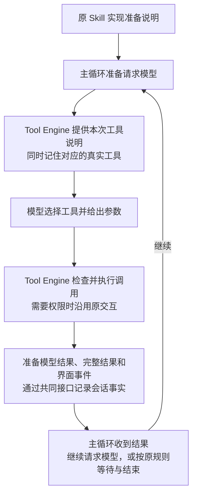
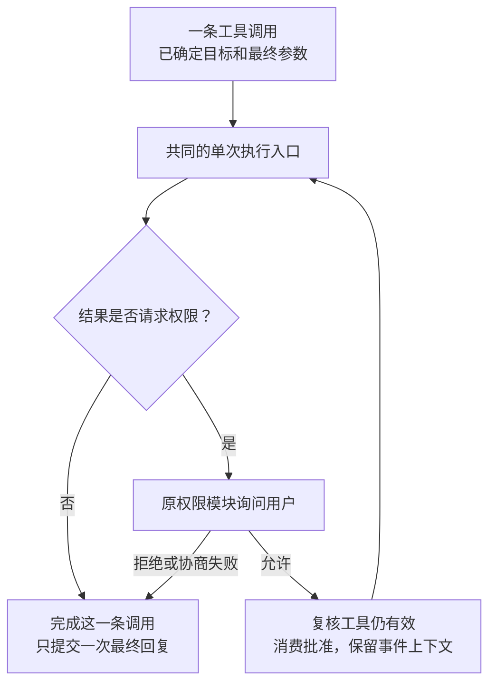

# Tool PR1 实施明细：代码迁移、提交和验证

日期：2026-09-08。状态：已批准，正在实施；实际完成情况见 [实施记录](progress.md)。**先读 [Tool 整体设计](design.md)，再按本文落代码和验证。** 总体原则、工具集合取舍、权限与失败政策以主文档为准。

源码行号对应固定的 2d0646931aa00a665b4661890f5e081ce2cc8430；本轮已拉取并核对最新 main **73cce3060dd708d50b0afff92b3f69acdeaf2d53**。其 PR112 增量见第 2 节，开工和提交 PR 前还需核对后续变更。

交付一个 Tool PR：在现有 tools 包内新增 `box_agent/tools/engine/`，组织目录、模型工具集、执行与结果，继续使用原 Skill 实现。先迁移共同执行，再在同一 PR 落实两档暴露、本地工具发现和明确改名；每项行为变化都有影响和兼容证据。Skill 内部状态重构属于第二个 PR。

技术沿用 Python 3.10+、Tool / ToolResult、asyncio、KernelServices / PluginHost、Session Log、pytest，不新增运行时依赖。本文的 C1–C6 是同一 PR 的内部提交，不是独立发布。

## 1. 先看这一个 PR 完成后，系统怎样工作

用户发来任务，原 Skill 逻辑继续选择和加载说明。主循环准备请求模型时，向 Tool Engine 要本次可用工具。模型提出调用后，主循环交给 Tool Engine，后者找到本次对应的真实工具，沿用检查、权限和调度规则执行，再交回完整的调用结果及界面事件。

**图 1 解释一次模型往返。** 原 Skill 逻辑在“准备说明”这一步继续工作；Tool Engine 不需要等待新 Skill Engine。



这次不是把读文件、运行命令、浏览器、MCP 等重新实现一遍。原工具代码继续干原来的事，改变的是由谁统一组织调用。

| 本 PR 必须得到的结果 | 用户可以观察到什么 | 代码上怎样判断完成 |
| --- | --- | --- |
| 所有既有能力继续可用 | 原 Skill 和任务仍能使用原工具；配置、权限、取消、输出保持兼容 | 全部支持的装配组合和执行入口进入清单，没有因未迁移而禁用能力 |
| 工具准备集中 | 模型看到的名字和参数能对应到本次实际执行的对象 | loop 不再自己维护可见工具表、别名表和 MCP generation 表 |
| 执行规则集中 | 首次调用、权限重试、独立工具调用的校验与事件处理一致 | 生产调用最终经过共同的单次执行函数；权限模块与子 Agent 不再裸调另一套执行逻辑 |
| 结果处理集中 | 模型摘要、完整输出、图片、文件、进度和日志均保留 | 串行与并行共用一次结果完成逻辑；业务加工归对应工具能力模块 |
| 可以独立发布 | 合并 Tool PR 后，无需再合 Skill PR 才能工作 | 新 Tool 与原 Skill 的完整兼容验收通过 |

## 2. 本次源码起点，以及需要修的具体问题

### 2.1 最新 main 与上轮审计的差异

上一轮审计固定在 56ee390。本次已拉取并检查 2d06469：期间合入 PR109、PR110，以及 LLM 和 MCP 修复。与 Tool 迁移直接相关的增量是：进程级 profile 目录隔离、工具运行目录与子进程环境传递、web extract 参数类型。它们已经属于本次必须保留的行为。

随后核对的 73cce30 只新增 PR112：managed stdio MCP 子进程收到当前 BOX_AGENT_HOME，覆盖 managed 配置中的旧 profile 值并保留其他环境变量；自定义 MCP、HTTP 配置及未设置 profile 的行为保持原约定。需继承 `tools/mcp_bootstrap.py` 修复和 `tests/test_mcp_bootstrap.py` 回归，不在新装配中丢掉它。

PR100 前的 f6bac85 继续作为历史能力参照，不能替换本次重构的直接对照版本。已有 `.understand-anything` 图谱仍基于 fb261b3，比当前源码旧；本方案只把它用作索引，下表结论均核对了真实文件。

### 2.2 当前不是“没有 Tool Engine”，而是只集中了一部分

源码路径均相对 Box-Agent 仓库；行号对应 2d06469。

| 当前职责 | 实际位置 | 本 PR 的处理 |
| --- | --- | --- |
| 构造基础和工作区工具 | `box_agent/tools/setup.py:247`、`:567` | 复用共同构造，不在新 Engine 再初始化一遍 |
| 会话工具表、MCP 激活和结果存储 | `box_agent/agent.py:501`、`:518`、`:533` | 保留唯一原对象，Engine 借用；不复制第二套会话状态 |
| 本次工具过滤、别名、目标与 generation | `box_agent/kernel/loop.py:1494`、`:1581` | 收入工具准备模块 |
| 调用去重、分组、预算、调用前后处理 | `box_agent/kernel/loop.py:2506` 至工具执行段 | 收入 Engine；对话的继续/结束规则仍归 loop |
| 已准备调用的串并行调度 | `box_agent/kernel/tool_engine.py:76` | 迁为 Engine 内部调度器，保持现有策略和兼容导出 |
| 权限协商后再次调用 | `box_agent/kernel/permission_gateway.py:79`，`:189` 直接 invoke | 保留权限规则，重试转入共同执行入口 |
| 结果处理与业务特判 | `box_agent/kernel/tool_result_pipeline.py:772` 等 | 分离通用结果完成与浏览器、搜索等专项处理 |
| 宿主主动调用工具 | `box_agent/runtime.py:34`；ACP 图片附件调用此入口 | 保留公共函数，内部使用相同执行与权限机制 |
| 子 Agent 批量文件读取 | `box_agent/tools/sub_agent_tool.py:393`、`:979` | 删除私有重试实现，委托公共直接调用入口；保留批量策略 |
| 工具结果持久化 | `box_agent/agent.py:1154` → `session_log.py:452` | 收拢为共同结果提交函数，Agent 不再重复承担 Tool 结果写入 |

### 2.3 允许明确改变的行为

“保能力”不要求把确定的缺陷复制过去。以下变化与本次迁移直接相关，必须在 PR 中单列测试和说明。

| 问题 | 当前证据 | 目标行为 |
| --- | --- | --- |
| 权限获准后的重试丢失事件上下文 | 上轮探针在 f6bac85 / 56ee390 均观察到；2d06469 相关路径仍未改变 | 重试沿用调用上下文，进度在完成前可见，父调用关联正确 |
| 并行结果可能使用另一条调用的参数 | 2d06469 的 loop 在 3328 取出 `fn_args`，3443 却传入上一准备循环遗留的 `par_fn_args`；本次仅源码确认 | 每条结果只使用自己的最终参数；不同 query / site 不串用 |
| 子 Agent 批量文件权限处理与公共入口不同 | 私有函数只重试一次，未调用批准消费方法 | 使用公共多门权限链，保留拒绝、取消和一次综合；增加对应回归 |
| Hook 改参数后，部分路径/可见性准备仍基于旧参数 | 当前开始 Hook 晚于若干调用前判断 | 保留开始事件的原语义；对 Hook 最终参数重新完成受影响的路径和执行检查，再执行。预算只扣一次，不因复核重复计数 |
| 普通 Tool 在模型请求期间改变参数定义 | 当前主要通过 MCP generation 保护外部工具；普通 Tool 没有同等参数定义检查 | 本 PR 新增定义一致性检查；定义未变保持原行为，变化后拒绝按旧请求执行，提示下一次重新准备 |

前三项是已有执行路径的问题；第四项落实“执行最终参数前完成相应检查”；第五项是新增加的请求与执行一致性保护，需要独立测试。Schema 参数合法性校验本来就在 `Tool.invoke()`，继续复用，不另写第二套校验器。

Skill 简介缓存和 active/preload 重复正文问题留给 Skill PR。Tool PR 不依赖它们的修复。

## 3. 代码按什么边界拆，状态放在哪里

### 3.1 一个 Engine，四部分实现

| 部分 | 负责的问题 | 不承担的事情 |
| --- | --- | --- |
| 工具准备 | 本次给模型哪些工具？名字和别名对应谁？ | 不重连 MCP，不重新创建工作区工具 |
| 调用执行 | 这次调用能否执行？权限重试怎样继续？ | 不决定用户任务的业务步骤 |
| 调度 | 哪些调用串行或并行？如何转发事件、超时和取消？ | 不改变已有工具顺序，不新增 Hermes 调度策略 |
| 结果完成 | 怎样保存完整输出、形成模型结果并返回界面事件？ | 不把所有业务规则写进 kernel，不自行判定业务任务完成 |

这四部分是同一 Python 模块目录下的职责，不是四个服务，也不引入插件式中间件平台。

### 3.2 生命周期保持现有边界

| 作用范围 | 保存什么 | 迁移约束 |
| --- | --- | --- |
| 进程 / profile | 配置、MCP 连接及当前目录、profile 路径 | `BOX_AGENT_HOME` 仍在导入前设置；不能当作会话开关 |
| 会话 / Agent | 原工具表、MCP 激活/exposure、工具内部状态、结果 store、原 Skill 状态 | Engine 引用原对象；一个 run 结束不能清掉它们 |
| 一次 outer run | 新 Engine、调用计数、搜索去重、取消和运行任务状态 | 与当前一次 `run_agent_loop` 的范围一致，不把 run 计数升级成全局账本 |
| 一次模型请求 | 本次工具说明、别名映射、真实对象和 MCP generation | 每次重新准备；tool_search 后的下一次请求可以看到新工具 |
| 一条工具调用 | 调用 ID、原名称、规范名称、最终参数、目标对象、事件上下文、结果 | 用同一个调用记录贯穿准备、执行和结果，避免平行字典错配 |

`Agent.tools` 继续兼容公开修改。新 Engine 借用同一可变表；本次请求另外保存自己的目标对应关系。关闭 Engine 只清理本 run 启动的任务和事件流，不关闭借用的 MCP、Jupyter、后台进程或清空 Skill。

## 4. 工具准备：保留能力，按主文档调整可见集合

### 4.1 本次请求的数据必须能对得上

新增一个普通数据对象 `PreparedTools`，表示“这次请求提供了哪些工具”。

| 字段 | 内容 | 用途 |
| --- | --- | --- |
| definitions | 当前 Tool 的两种 schema 实际输出副本，顺序不变，并保留 MCP 来源标识 | 提供给模型、request/header 和缓存指纹，三处使用同一份定义 |
| targets | 规范名称 → 本次真实 Tool 对象 | 执行时取这份目标，不查一个可能已换对象的全局同名项 |
| call_names | 规范名、显式别名、连字符兼容名 → 规范名称 | 保留当前调用兼容，不把别名全部暴露成新工具 |
| mcp_generations | 本次 MCP 工具对应的服务器 generation | 执行前及权限获准后复核旧对象是否仍有效 |

definitions 只复制说明，不复制工具实例、连接、锁或进程。模型端用轻量 Tool 视图返回冻结的 `to_schema()` / `to_openai_schema()` 实际输出，兼容自定义 Tool 对这两个方法的覆盖，不按基础字段重建后丢掉扩展信息。视图保留现有缓存指纹读取的 `server_name` / `_server_name` 等来源信息，避免 MCP 计数与 hash 变化；它不能作为执行目标。上下文整理所需的工具运行状态仍从真实工具取。参数定义在请求期间变化时不得按另一份 schema 静默执行，返回需要重新准备工具的诊断。

C2 先保留原顺序：原稳定工具表 → 现有 MCP exposure → 浏览器意图过滤 → 别名检查 → 保存本次定义和对象。C5 再将直接提供/会话已激活的本地工具选择纳入这条准备流程，保留受支持模式和明确覆盖规则；差异与主文档第 3、4 节逐项对应。模型原始消息不改；执行副本按本次别名表规范化。

### 4.2 不能把现有“有意覆盖”误判成错误

`setup.py:656–660` 会用带当前进程 owner 的 bash output/kill 工具覆盖基础实例。旧 eager MCP 模式也允许覆盖已有 fallback，断开后需要恢复。继续沿用这些装配规则，再检查真正的别名冲突。

Deferred 模式继续保护稳定工具名称及别名。不能为了“统一注册”一刀切禁止所有同名覆盖，也不能让新 MCP 默默覆盖受保护工具。

### 4.3 发现复用 MCP 基础，并扩展到本地低频工具

继续使用 `MCPToolCatalog`、`ToolSearchTool` 和 `MCPToolExposureManager`，保留：

- 未激活的普通 MCP 工具不暴露；alwaysLoad 保持直接可见。
- tool_search 的激活只影响当前会话，下一次模型请求才使用新的可见集合。
- 精确名称查询不自动做模糊替代；关键词命中导航时原有 companion 激活规则保持。
- loading 与无结果分别报告；重连、撤销及 generation 变化使旧选择失效。
- eager 配置、断开后恢复 fallback、真实 remote name 与模型公共名映射都继续支持。
- ACP 初次发现和认证后刷新时机仍由宿主处理；Engine 不把后台发现改成阻塞 prompt。

C5 在原 tool_search 增加本地工具候选：保留 query / queries / tool_names / server_name / top_k 和精确优先、不截断精确命中的规则；server_name 只过滤 MCP，按允许范围过滤，在查询后记录本会话追加的规范名称。本地命中不受 MCP readiness 等待阻塞，未就绪来源单独报告；保留 companion 和既有计数字段含义。本地完整目录的规范名及别名继续参与 deferred MCP 冲突保护，隐藏不释放名字。只有名称/描述/提供条件等策略元数据需要补充，原 Tool 实例和 MCP 状态仍只有一份。无 MCP 配置但有本地延迟工具时，同样注册 tool_search。

场景组合来自明确的宿主 mode/配置、已有状态（含恢复、暂停与阻塞）和可信 Skill 工具提示表，先能力限制、再合并必要工具，不新增模型意图路由器。禁止隐去仍被宿主必需流程使用的工具；低频工具撤下常驻前，先验证能力目录、精确旧名查找和下一请求实际可调用。会话激活稳定追加；撤权、来源失效和 generation 变化优先于缓存。

这里只延迟完整 schema 的提供，不增加通用延迟实例化。各工具的保留、提供条件和 prepare_scheduled_task 改名以主文档第 3 节为准；不把每个工具都变成必须先搜索。

### 4.4 能力清单按实际装配组合建，不按几个常用工具建

| 工具组 | 来源或条件 |
| --- | --- |
| 文件读写/追加/编辑、搜索、JSONL 查询 | 工作区工具开关与原权限配置 |
| bash、后台输出和终止；Jupyter 与 sandbox status | 原运行模式、session process owner、sandbox 配置 |
| todo、plan、goal、用户澄清/决策、执行结果报告 | 原开关；goal 工具在 Agent 构造后补充 |
| 记忆工具、定时任务、MCP 配置 | 原 manager、路径与工具配置 |
| 图像检查、生成、Obsidian 工具 | 模型能力、endpoint 或原宿主环境条件 |
| sub_agent | 原开关与模型；保留父会话实时可见工具的继承 |
| get_skill / skill_view | 原 Loader、禁用与显式允许、预加载字典 |
| tool_search、alwaysLoad、会话激活与 eager MCP | 原配置及动态连接状态 |
| search_skillhub、install_skillhub_skill | ACP 宿主能力协商后注册，不能误当所有入口的默认工具 |

对照清单记录名字、schema、别名、启用条件和依赖对象；另记录 C5 的目标差异、原调用者与替代路径，不能把差异全部忽略或全部判失败。CLI、general/fast/utility ACP、公开 Agent、direct core、子 Agent 各自与自己的基线比较，不要求它们彼此工具集合相同。

## 5. 调用执行：首次、重试、独立调用共用一套底层实现

### 5.1 分清“模型的一次调用”和“执行尝试”

模型提出一次 `bash` 调用，程序第一次发现需要授权，用户允许后再执行。这是一个模型调用、两次执行尝试。最后仍只有一个模型工具回复和一个最终 ToolCallResult。

**图 2 专门说明权限重试。** 重试回到同一个执行入口，保留调用 ID 与事件上下文；不会再请求一次模型。



### 5.2 共同执行顺序

1. 根据本次工具表解析名称，沿用重复调用识别、既有预算和当前对话的允许范围。
2. 保留 ToolCallStart 的显示规则。开始 Hook 可以修改参数；随后复核最终参数涉及的路径、可见性及执行策略。Schema 仍只在第 4 步由 Tool.invoke 校验，保持原无效参数的记录语义。准备过程中预算至多保留一次，重试不另扣模型调用次数。
3. 将最终参数记入现有 `tool/call`，沿用执行前 flush；记录失败就不启动该调用。
4. 共同单次执行函数调用 `Tool.invoke()`。普通工具保持现有调用方式，事件型工具传入本条调用的 `ToolInvocationContext`。
5. 调度器实时转发进度与活跃事件，沿用取消、宽限和异常规则。
6. 首次结果需要授权时，进入同一权限链；最终结果再统一完成业务适配、结果 Hook、内容处理和记录。

每条调用持有自己的目标、最终参数、路径准备结果、开始时间、可见性与上下文。串行和并行结果不再从上一循环变量或多个独立字典拼装。

### 5.3 权限链采用流式实现，保留当前顺序

把现有 `_negotiate_tool_permission_chain` 的规则迁入一个异步迭代器。它在获准后消费共同调度器的一次执行流：Progress / Activity 当场转发；某次尝试的 Completed 只更新内部结果，链结束才产出最终结果与 policy_decision。

| 当前约定 | 本 PR 的决定 |
| --- | --- |
| 最多 4 次权限重试；相同权限请求获准后再次出现要终止 | 保持常量、JSON 请求去重及原诊断 |
| 用户拒绝、协商异常、没有 negotiator | 保持原返回结果、policy payload 和宿主事件约定 |
| 每次获准后复核 MCP 可用性，再消费批准 | 保留，消费方法仍是工具已有 `approve_permission_request()` |
| 同一调用的开始 Hook、调用预算与 ToolCallStart | 只发生一次；不因权限重试重复触发 |
| 重试中的进度和父调用 | 复用本条调用的上下文；原调度器新增可选上下文参数，默认调用形式保持兼容 |
| CancelledError、SessionLogDurabilityError | 向上传递并停止相应执行，不能包装成可继续的普通失败 |

旧的 tuple 返回 helper 若仍需兼容，由薄包装消费这个流式实现；生产主链使用流式入口，不能等整条重试结束再补发进度。

### 5.4 不在本 PR 改并行策略

保持当前行为：普通调用先按既有串行组执行，之后执行 parallel_safe 组；混合搜索和有状态调用继续遵守当前特殊规则。存在会结束当前 turn 的可信交互工具时，整组保持原模型顺序，成功后的兄弟调用返回原跳过结果。

**并行首轮全部收齐之后，再按输入顺序处理权限链。** 不把完整权限链塞进每个并行任务，避免多个授权交互同时打开。现有 parallel batch timeout 只管原首轮批次，不扩大到随后等待用户授权的时间。

保留并发上限、web_search 特定并发限制、部分超时结果、取消宽限、迟到任务回收，以及原有完成顺序。Hermes 的连续分组和路径冲突调度不属于这个 PR。

### 5.5 独立工具调用继续走已有公共入口

保留 `runtime.invoke_tool_with_permissions(tool, arguments, *, permission_negotiator=None)` 的原返回值。可增加可选的 `invocation_context` 与 `is_cancelled` 参数，未传时保持原调用形式；内部消费共同执行与权限流，进度转交提供的父事件队列。

此入口用于 ACP 图片附件以及子 Agent 的 batch_files。它不创建 LLM 请求，不编造模型 tool_call，不向对话追加工具回复。批量文件仍由子 Agent 控制并发、完整性和 200k 总量限制，最后只做一次模型综合。

提供的父事件队列只作为输出目标。执行层为本条调用管理自己的队列，同一权限链的各次尝试复用它；runtime 将流事件单向转发给父队列，父调用 ID 保持一致。不能消费父/兄弟队列，也不能取出事件后再放回同一个队列形成循环。

统一的是校验、真正调用、权限链、上下文和错误处理。普通 Agent loop 的调用顺序与 batch_files 的原并发策略各自保留。直接调用目前有自己的异常输出约定，也通过薄适配保留，不强行把所有入口改成同一段错误文本。

## 6. 结果与日志：统一完成过程，但保留不同内容用途

### 6.1 结果不能被压成一个字符串

| 内容 | 保留的用途 |
| --- | --- |
| 原 ToolResult.content / error / success | 真实调用结果；Hook 不反改原始执行事实 |
| Hook 后的展示内容 | CLI / ACP 界面呈现 |
| model_context 或正常模型内容 | 下一轮模型看到的结果 |
| persistence_content | 工具已截短输出时，仍可保存的完整文本 |
| raw_output | 原结构化附加信息、文件/引用/权限等元数据 |
| transient_followup_content | 可信工具给下次模型请求的一次性多模态内容；不写入持久历史 |

工具返回后，单条调用记录保留原 success/error 与必要结构化执行事实；后续结果适配和 Hook 使用展示/模型内容，不原地覆写原事实记录。只保存需要核对的事实，不为此复制整份图片和大对象，也不新建一套持久化结果库。

保留现有字段、信任标记和处理优先级。Context 模块仍负责瞬态内容的模型能力与预算验证；Engine 调用现有逻辑，并把经验证的内容交回请求组装。ToolResultStorage 仍负责大结果存储与预算，路径仍来自当前 profile。

### 6.2 专项处理归对应能力

| 现有处理 | 目标位置 | 必须保持 |
| --- | --- | --- |
| 搜索查询去重、配额、站点筛选、结果排序和引用元数据 | `tools/web_search_runtime.py` | 原计数范围、原搜索规则、每条调用使用自己的参数；返回摘要/提示供 loop 使用 |
| 浏览器意图、snapshot/screenshot 的输出参数与保存 | `tools/browser_result_adapter.py`，复用原 browser intent 模块 | artifact root 限制；snapshot 保存失败与 screenshot advisory 的原区别 |
| get_skill 结果激活 | `tools/skill_result_adapter.py` | 原状态与 direct core fallback，详见第 7 节 |
| 文件结果、分页/资源回执、占位符写入防护与恢复 | `tools/file_result_adapter.py`，复用现有 context_resources / model_history | 读取完整性和写入前修复规则不变，不把历史占位符写成实际文件内容 |
| 工具产物检测 | `tools/engine/artifact_results.py`，复用已有 `artifacts.py` | 串行前后快照；并行引用检测加一次批次差分；不声称获得新的精确逐工具归因 |
| 模型 tool reply、未完成调用补齐 | 通用结果模块及 kernel 的消息提交边界 | 每个模型调用 ID 有且仅有一条最终回复；重复调用只执行首次，其他有原隐藏回复 |

这些模块先采用明确函数调用和少量既有工具类型/名称绑定，不建设自动发现的适配插件平台。新增一般工具不需要改 loop；特殊展示仅修改自己的适配与注册。

结果处理保持原相对顺序：**浏览器落盘 / 原 Skill 激活 / 瞬态内容验证 → 结果 Hook → 搜索去重、资源回执、模型内容、大结果存储 → 唯一消息提交及资源记录 → ToolCallResult、搜索与产物事件。** 不能把所有专项适配一律移到 Hook 前，例如搜索去重原本处理的是 Hook 后内容。

### 6.3 确定唯一的结果记录方

当前是 loop 写 `tool/call`，Agent 收到 ToolCallResult 后补写 `tool/result`。新方案把工具结果提交收拢到 **kernel 提供的共同提交函数**，Tool Engine 调用它；该函数使用原 SessionStorePort。同步删除 Agent 对同一 ToolCallResult 的专门持久化分支。

同时拆掉旧 `process_tool_result()` 内部的 `messages.append`：新的 results 模块只准备结果，由共同提交函数唯一追加消息。资源 ledger 在成功提交对应消息之后再登记，避免一份回复追加两次或登记一份并未进入历史的内容。

提交函数按以下步骤工作：

1. 接收准备好的 tool message 和最终结果元数据。
2. 向当前历史追加这一条 tool message。
3. 有持久化会话时，调用 `append_unlogged_messages`，使用原 `success/content/error/rawOutput/policyDecision` 字段写入。rawOutput 必须取经 `_trace_safe_tool_raw_output` 处理的原事件侧数据，不能直接写原始 ToolResult.raw_output；截图字节和一次性 followup 内容不进入持久日志。
4. 成功后才向调用方交付最终 ToolCallResult 及后续产物事件；失败向上传递，不继续启动后续调用。

这里保留已有 flush 节奏：执行前的 tool/call 必须 flush；最终 tool/result 先 append，随后由原 StepEnd、下一次调用/模型请求等边界 flush。**本 PR 不新增每条结果额外 fsync。** 不能把 append 成功表述为该结果已单独 fsync。

Agent 在 StepStart/StepEnd/Done 的通用消息同步仍可保留；已经提交的结果不是新增消息，不再建立第二套结果写入规则。direct core 传入 SessionLog 时也使用同一提交函数，完整元数据不依赖外层 Agent 才能写入。

一次权限尝试的诊断继续进入现有 logger/trace，可带 attempt 次数；确实派发的模型调用写一次顶层 tool/call，前置拒绝、未知/隐藏工具和重复跳过不伪记为已派发。每个模型调用 ID 仍有一条最终工具回复及对应 tool/result；不增加需要迁移的 Session Log 事件类型。logger 和 trace 不成为第二份可恢复会话状态。

恢复继续区分 TOOL_NOT_STARTED 与 TOOL_OUTCOME_UNKNOWN。日志失败或外部结果未知时，不自动重做可能已有副作用的调用；代码回退也不能撤销已产生的外部改变。

## 7. 原 Skill 怎样完整保留下来

Tool PR 只搬“工具加载后怎样转交原 Skill 处理”，不迁移 Skill 的内部状态。

| 场景 | 适配代码必须做什么 |
| --- | --- |
| 正常 get_skill / skill_view | 调原 Loader；保留全文用于 UI/记录；通过原激活器向 system 说明区提供正文；模型工具回复仍是短确认 |
| 已预加载，hash 匹配 | 引用本会话原预加载字典，保留原短确认，不重复激活 |
| broken、失败、空正文、已有 model_context | 保留原分支，不把诊断当成可激活的 Skill |
| 可信激活判定 | 沿用 `loads_active_skill_instructions` 及原结果检查；不信任任意 raw_output 自报的“加载成功”字段 |
| public Agent | 调原 `activate_skill_instructions`；原 active 字典、hash、顺序和 skill/change 记录仍在原所有者 |
| direct core / 普通子 loop | 保留原 system message fallback；没有 system message 时维持原结果，不凭空创建一段 system |
| CLI / ACP / 会话恢复 | 保留原来源、选择、禁用、依赖、profile、预加载与恢复检查；不复制新旧状态后同步 |
| 子 Agent | 保留其原工具裁剪和 Skill 指导规则，不自动继承父会话全部已加载正文或扩大权限 |

第二个 PR 再把这些调用转交统一 Skill Engine。因此第一个 PR 的 Skill 适配会成为明确交接点，第二阶段无需重写 Tool 的执行和日志流程。

## 8. 接入接口与文件改动清单

### 8.1 给主循环的入口保持少量、明确

| 入口 / 数据 | 输入 | 输出与责任 |
| --- | --- | --- |
| `prepare_tools()` | Engine 已借用的会话工具表、exposure 与本 run 过滤规则 | `PreparedTools`，用于本次模型请求与执行 |
| `PreparedTools.canonicalize_calls(calls)` | 模型原调用列表 | 规范化名称的执行副本；原 assistant 消息不变，供原 loop 空参数保护等使用 |
| `execute_calls(calls, prepared, step_control)` | 本次执行副本、工具对应关系、当前 step 的允许范围 | `AsyncIterator[AgentEvent \| ToolStepSummary]`：逐项 yield 原事件；正常结束最后 yield 一份内部汇总 |
| `ToolStepControl` | step 编号、当前允许的工具名或不限制、跳过理由、已有计划审批元数据 | loop 提供对话边界，Engine 遵守；不把完整业务决策塞进 Engine |
| `ToolStepSummary` | Engine 汇总本次实际结果 | 是否有进展、可见调用数、可信交互结束标记、原预算提示、下一次请求的瞬态内容；供 loop 继续原规则 |
| 共同记录回调 | 本条调用的最终参数；或最终模型回复与结果元数据 | kernel 提供调用记录/结果提交函数；Engine 不另建消息历史或会话数据库 |
| `runtime.invoke_tool_with_permissions(...)` | 一个真实 Tool、参数、可选权限/事件/取消上下文 | 原 `(ToolResult, policy_decision)`；独立调用不经过模型对话收尾 |

Engine 的构造接收现有服务引用和本 run 选项；上述参数不重复打包整份 Agent。开始实现时将字段落在普通 dataclass 与 Protocol，避免以不透明 `**kwargs` 转运全部局部变量。

ToolStepSummary 由 loop 消费，不能作为 ACP/CLI 事件外发；取消或异常向上传递，不伪造正常完成汇总。异步生成器不使用带值的 return。

`ToolStepSummary` 中的提示由对应工具规则产生，loop 只按原位置加入模型输入；loop 保留 max_steps、无进展保护、计划审批与 turn 结束决策。搜索去重、浏览器保存等业务字段不再散落在 loop 中。

### 8.2 建议落点

| 文件 | 改动内容 |
| --- | --- |
| 新增 `box_agent/tools/engine/engine.py` | DefaultToolEngine，组织准备、调用、共同结果完成；每 outer run 一个对象 |
| 新增 `box_agent/tools/engine/preparation.py` | 本次工具定义、目标、别名、场景组与本地激活准备；复用现有 MCP exposure |
| 新增 `box_agent/tools/engine/execution.py` | 共同单次执行、流式权限链、直接调用适配 |
| 新增 `box_agent/tools/engine/scheduler.py` | 从 kernel/tool_engine 搬原调度器；原 ToolEngine 类名及构造兼容保留 |
| 新增 `box_agent/tools/engine/results.py` | 通用结果准备、Hook、内容通道、存储与专项适配组织 |
| 新增 `box_agent/tools/engine/artifact_results.py` | 原工具产物检测相关函数迁移 |
| 新增 `box_agent/tools/engine/contracts.py` | 上表几个跨边界数据对象；仅依赖 base/schema/events 等中性类型，不反向导入 loop 或具体 Engine |
| 新增 `box_agent/kernel/tool_messages.py` | 共同调用记录/最终回复提交；原未完成 tool call 消息修复 |
| 新增 `box_agent/tools/{web_search_runtime,browser_result_adapter,file_result_adapter,skill_result_adapter}.py` | 第 6、7 节列明的现有业务函数迁移；不重写原工具 |
| 修改 `box_agent/kernel/ports.py` | 增加 ToolEnginePort；已有工具表/exposure/resultstore 契约仍供兼容装配使用 |
| 修改 `box_agent/composition.py`、`box_agent/plugins/defaults.py` | 默认 Engine 注入既有 PluginHost；不把 Engine close 变成关闭借用资源 |
| 修改 `box_agent/kernel/loop.py` | 删除自行准备工具及两套调用收尾；只消费 Engine、提交回调和 step 汇总；保留对话控制 |
| 修改 `box_agent/kernel/{tool_engine,permission_gateway,tool_result_pipeline}.py`、`box_agent/core.py` | 兼容导出转发到单一实现；旧入口可留，旧执行逻辑不再并存 |
| 修改 `box_agent/runtime.py`、`box_agent/tools/sub_agent_tool.py` | 直接调用和 batch_files 收拢；不引入子 Agent 多轮循环 |
| 修改 `box_agent/agent.py`；按需修改 CLI / ACP 装配处 | 移除重复 Tool 结果写方，接装配；保留公开签名、原工具表和全部 Skill 状态 |
| 修改 `box_agent/tools/mcp_tool_search.py`、`tools/setup.py` 与现有提示构造 | 本地低频候选与 MCP 共用查找入口；有延迟候选就提供搜索；短能力目录与场景工具组 |
| 修改 `box_agent/tools/schedule_tool.py`、`sub_agent_capabilities.py`、`box_agent/config/system_prompt.md` | 模型规范名 prepare_scheduled_task、旧名入站别名、权限/委派分类与文案同步 |
| 按实际依赖更新 `box_agent/skills/scheduled-task/SKILL.md` 等工具名称引用 | 保留业务步骤及产物要求；更新 description/正文并按仓库流程生成 `_manifest.json`；旧 Skill 固定测试与新引用测试分别保留，不重构 Skill 状态 |
| 修改/补充对应 `tests/` | 见第 10 节；不修改业务要求或删除失败用例来迎合测试 |

文件数来自已经存在的职责拆分，不要求为每个工具新建 adapter。现有 scheduler 的 ToolEngine 与新增 DefaultToolEngine 需在导出中明确区分：前者是兼容保留的底层调度器，后者才是本 PR 的完整服务。

当前 `tools/__init__.py` 会导入 setup 等较重模块，`kernel/__init__.py` 也会导入 loop。移动 contracts 并不自动解决循环导入：避免两个包顶层互相 re-export，必要兼容入口采用轻量或延迟导出；在全新进程逐个及交叉顺序 import，构建 wheel 后再验证。这里是 tools 的内部 Python 子包，不新建顶层工具系统或 Git submodule。

### 8.3 兼容装配的具体要求

默认 composition 创建并注入新 Engine；核心循环不在每个 step 重新构造调度服务。原纯装配 helper 继续只组装既有对象，不能隐式联网或初始化环境。

KernelServices 新增字段采用尾部可选字段，旧构造形式保持可用。对于未传新服务的旧 kernel 调用，在 `AgentLoopKernel` 的入口边界一次性用原 tools/exposure/resultstore 创建默认 Engine；只创建运行对象，不启动 MCP，不走旧执行分支。这个兼容默认值只存在于入口，执行中的 loop 统一使用解析后的服务。显式注入的服务不被默认值覆盖。

原 core/runtime 的公开函数签名和兼容 re-export 保留。新的内部类型不要求 CLI、ACP 或业务 Skill 自行构造。

## 9. 一个 PR 内怎样实现和审查

分支建议 `codex/refactor-tool-engine`，从开工时的 upstream/main 创建独立 worktree。下面 C1–C6 是该分支的提交顺序，不单独开 PR、不作为半成品发布。

### C1：固定基准，建立可见行为清单

- [ ] 从 73cce30 或开工时更新后的固定 main 记录工具装配清单、配置、接口与现有测试基线。
- [ ] 列出最新 main 相对历史 baseline 的能力差异，区分已接受产品变更、历史缺陷和未验证项。
- [ ] 在 `tests/test_tool_engine_compatibility.py` 增加装配对照，使用受控替身构造各宿主能力条件，避免扫描个人配置/发起 MCP 网络。
- [ ] 对既有断言先在未改实现的版本运行；基线失败独立记录，不把迁移前已失败的用例当成新增回归，也不删除它。

**提交检查：** 工具清单包含第 4.4 节全部组，实际状态项用“通过/失败/未验证”，不能只列预期。先跑 alias/schema/MCP exposure/profile 等确定性用例。

### C2：接入 Engine 与工具准备，保留原执行行为

- [ ] 建立第 8 节的契约与默认装配；明确每 run / 每请求 / 借用会话对象的作用域。
- [ ] 提取准备工具、别名与 generation 逻辑；模型、header 与指纹消费同一份定义。
- [ ] 搬原 scheduler，保留旧 import 入口和默认行为；原工具类继续执行。
- [ ] 验证 tool_search 后下一步可见、下次 turn 激活不丢、run 关闭不销毁借用资源。

**提交检查：** 工具集合、顺序、schema、别名与支持配置对照一致；新旧实现仅做只读定义对比，不能双跑有副作用的工具。

### C3：收拢单次执行与权限链

- [ ] 先补“获准后的事件实时性和父调用正确”“并行审批顺序”“多门权限只形成一个最终回复”的回归，记录旧行为失败点。
- [ ] 提取共同单次 invoke；流式权限链按第 5 节实现，首次与重试共用上下文和调度规则。
- [ ] 将 runtime 直接调用与 sub_agent batch_files 转入同一底层实现，保留各自对话/并发策略及错误呈现。
- [ ] 检查 Hook 最终参数、调用前记录、取消和持久化异常；不重复扣预算或触发开始 Hook。

**提交检查：** 权限、事件、直接调用和子 Agent 对应测试通过；没有新的重复执行或后台等待路径。

### C4：收拢结果，迁业务处理，接原 Skill

- [ ] 先增加“不同参数并行结果不串用”的行为回归，再用单条调用记录修复参数归属。
- [ ] 提取第 6 节专项函数；串并行走同一结果完成逻辑，保持字段、Hook 顺序与输出语义。
- [ ] 迁 get_skill 激活协调，复用 Agent 和 direct core 的原分支；不迁原 Skill 内部状态。
- [ ] 引入共同结果提交，移除 Agent 的重复写入责任；保持原记录 schema 和 flush 边界。
- [ ] 检查一条模型调用恰好一个最终消息/事件，权限尝试和非模型直接调用不伪造回复。

**提交检查：** 结果通道、Session Log、Skill、浏览器/搜索/产物回归通过；新 Tool + 原 Skill 的恢复正常。

### C5：调整工具集合、完成名称迁移并关闭执行旁路

- [ ] 实现本地低频与 MCP 联合发现；MCP 关闭时仍能查找本地工具，旧 Skill 的精确名字可以抵达目标。
- [ ] 按主文档第 3 节配置直接/可发现工具；读取原 plan/todo/goal 和进程状态，保留宿主必需的交互与结构化回执。
- [ ] 将 create_scheduled_task 改为 prepare_scheduled_task，仅展示新 schema；旧名兼容转到同一目标，保留 officev3_schedule_draft payload 和原调用 ID；历史恢复只重建记录/展示，不因旧名映射重新派发草稿。
- [ ] 完成 Skill、提示、setup、子 Agent 分类、日志恢复、配置与测试的变更表。别名不能绕过本次可见性、权限或父会话范围。
- [ ] 定位实际运行的宿主版本，验证草稿卡片、用户保存边界和交互语义；当前本地 officev3 无消费代码的检索结果不代表无影响。


- [ ] 核对 CLI、ACP 各模式、Agent、core/runtime、普通子 Agent、batch_files、ACP 附件路径。
- [ ] 检索生产 `.invoke()` / `.execute()` 调用，逐项解释保留位置；Tool 类内部或第三方 client 的 execute 不能机械算作旁路。
- [ ] 删除旧重复执行、权限重试和结果业务实现；兼容入口仅转发到已迁移实现。
- [ ] 核对 PR110 / PR112 profile 路径、managed stdio 环境与生命周期，全部原能力仍按配置提供。

**提交检查：** 删改影响表全部有对应验证，无静默丢失工具/宿主能力；主循环中不再出现搜索排序、浏览器文件持久化、Skill 激活业务实现；无须修改 loop 即可接入一个普通测试 Tool。

### C6：完成验证与 PR 交付材料

- [ ] 运行共享核心/ACP/工具/Skill 回归及仓库 preflight；处理本 PR 引入的失败。
- [ ] 固定相同模型、Skill、输入与配置做主分支/新实现任务对照，检查实际产物；记录外部依赖和 skip。
- [ ] 检查打包包含新模块，保留源码测试、build、安装、宿主运行各自证据边界。
- [ ] 更新仓库贡献文档中的架构和兼容说明；编写 TPR 描述，列出本 PR 的明确行为修复。
- [ ] 开 PR 前按仓库要求 rebase 最新 upstream/main，在准确的最终 PR Head 重新运行完整 preflight；任务评测按增量影响重跑，并保留每份证据对应的 SHA；只开一个 Tool PR。

只有 C6 的完整验收满足后才把这个 PR 标记为可合并。第二个 Skill PR 以 Tool PR 合并后的 main 为基础。

## 10. 怎么证明没有丢能力

### 10.1 必须补充的组合测试

已有测试覆盖很多单点，本 PR 重点补容易在“收拢”时出错的组合，而不是重复断言内部方法被调用。

| 测试文件 / 新用例方向 | 必须观察到的事实 |
| --- | --- |
| `tests/test_permission_negotiation.py`：事件型工具获准后重试 | 第二次尝试仍有正确上下文；进度在执行完成前被消费者收到；仅一个最终模型回复 |
| 同文件：并行首轮 + 两条权限链 | 审批按原输入顺序开始；等待审批不被首轮 batch timeout 中止；已完成兄弟结果保留 |
| `tests/test_tool_result_pipeline.py`：不同参数并行 | 从 loop / execute_calls 发出 A/B 调用，再检查各自 query/site 的结果；仅单测两次结果函数抓不到旧循环变量错配 |
| `tests/test_agent_session_persistence.py`：多次尝试 | 顶层 tool/call 和最终 tool/result 各一条；最终参数已在真正副作用前持久化；Agent 不重复写 |
| `tests/test_tool_engine_compatibility.py`：实例/定义 | C2 与原基线一致；C5 仅有已列明差异，旧名兼容不扩大可执行范围；本次目标不被全局对象替换；run close 不清会话资源 |
| 同文件：定义视图与定义变化 | 自定义 schema 输出及 MCP 指纹信息保留；参数定义未变正常执行，等待模型期间改变后不执行旧调用 |
| `tests/test_core.py`、`tests/test_skill_tool.py`：原 Skill 桥 | Agent/direct core、正常/预加载/broken/失败保持原正文、短确认和激活行为；source/hash 恢复仍有效 |
| `tests/test_sub_agent_tool.py`：batch_files | 文件各读一次、仅一次 generate、禁止额外 generate_stream；父权限与取消有效 |
| `tests/test_hooks.py`：最终参数 | Hook 改参数后检查对应实际路径及对象；原开始事件规则保留，预算与 Hook 次数不增加 |
| `tests/test_tool_engine.py`：作用后失败 | 工具已经写标记再报错，不能退到旧实现重做，标记次数仍为一 |
| `tests/test_isolated_profile.py`、`tests/test_user_paths.py`、`tests/test_mcp_bootstrap.py` | profile 隔离与 managed stdio 环境继承；自定义/HTTP 配置不被误改 |
| `tests/test_mcp_tool_search.py`、兼容测试：本地发现 | MCP 关闭/连接中不阻塞本地；server_name、top_k、精确优先、companion 与计数兼容；隐藏本地规范名/别名不被远端顶替；下一请求真实可调用 |
| `tests/test_schedule_tool.py`、alias/子 Agent/宿主探针 | 仅新 schema、旧名入站、原草稿 payload 与消息恢复；不把草稿误报为已保存 |
| 兼容测试与任务对照：工具组 | 宿主必需工具直接提供；原 Skill 所需能力可达；无活动状态时仍可发现 plan/todo/goal；没有可见性绕权 |
| `tests/test_bash_tool.py`：动态辅助工具 | 活动与已结束未读输出都可获取；跨 turn / owner 行为正确；失效句柄不会启动新命令 |
| 新进程与 wheel import 检查 | tools/kernel 公开 import 和兼容入口无循环依赖，新文件真实打入安装包 |
| `tests/test_agent_session_persistence.py`：图片与瞬态内容 | 实际 Session Log 原文不含截图 base64 / 瞬态 payload，完整文字与安全元数据仍保留 |

例如权限用例不能只断言“结果成功”。测试工具应先返回 permission_request；批准后发一条进度，再等待测试释放它。消费者必须在释放前收到该进度，并检查父调用 ID。最后同时检查两次尝试、一次业务副作用、一次最终回复。这能识别“重试执行成功，但实时事件链断了”的缺陷。

### 10.2 实施时的确定性检查命令

以下命令均从实现 worktree 根目录执行；本次方案编写未运行它们。按提交涉及范围运行前两组，最终执行仓库完整门禁。

```bash
uv run pytest -q --tb=short \
  tests/test_tool_engine.py tests/test_permission_negotiation.py \
  tests/test_tool_result_pipeline.py tests/test_tool_result_storage.py \
  tests/test_tool_call_closure.py tests/test_tool_aliases.py \
  tests/test_tool_schema_validation.py tests/test_hooks.py \
  tests/test_kernel_compatibility.py tests/test_kernel_state.py \
  tests/test_plugin_host.py tests/test_agent_run_options.py \
  tests/test_agent_session_persistence.py tests/test_session_log.py
```

```bash
uv run pytest -q --tb=short \
  tests/test_core.py tests/test_tools.py tests/test_acp.py tests/test_acp_auto_mode.py \
  tests/test_cli_config.py tests/test_sub_agent_tool.py tests/test_sub_agent_capabilities.py \
  tests/test_mcp_tool_search.py tests/test_browser_tool_names.py tests/test_browser_intent.py \
  tests/test_skill_tool.py tests/test_skill_preload.py tests/test_skill_loader.py \
  tests/test_skill_filter.py tests/test_skill_prompt_layout.py tests/test_skill_runtime.py \
  tests/test_bash_tool.py tests/test_execution_result_tool.py \
  tests/test_schedule_tool.py tests/test_mcp_bootstrap.py \
  tests/test_staged_file_write_tool.py tests/test_file_tool_size_guard.py \
  tests/test_image_inspection_tool.py tests/test_image_generation_tool.py \
  tests/test_jupyter_tool_limits.py tests/test_jupyter_timeout_session.py \
  tests/test_context_resources.py tests/test_isolated_profile.py tests/test_user_paths.py
```

新增的兼容测试文件在 C1 创建后单独执行：

```bash
uv run pytest -q --tb=short tests/test_tool_engine_compatibility.py
```

最终门禁使用仓库的真实脚本：

```bash
bash general_review/ci/preflight.sh
```

该脚本会安装锁定依赖、compileall、运行完整 tests（只有仓库已经指定的 unreachable MCP timeout 用例被 deselect）、构建 sdist/wheel。不能另建一条删掉更多失败用例的“绿色门禁”。基线已有失败与 PR 新失败分别报告。

### 10.3 真实任务保能力：复用原案例和 Skill

优先复用本地已有案例，而不是新造一个容易通过的简化 Skill。至少选一个普通文件/数据任务、一个含搜索或子 Agent 的复杂任务、一个现有 PPT 任务；涉及可编辑 PPTX 时另验导出。

已有可选固定资料（下面 TestCase / TestRun 路径相对 `<external-evaluation-workspace>/`，不在实现 worktree 中）：

- `TestCase/20260824-validation.jsonl` 中的 `ai-quality-scheduling-bp`、`noon-studio-portfolio`、`arxiv-paper-presentation`、`employee-onboarding-presentation`。
- `TestRun/20260903_dazzle_compare/dataset.runtime.sn-ppt-dazzle.jsonl` 中的 `cloud-castle-360`、`china-nev-2024-2026`、`boutique-coffee-mall`。
- 原 `test_workspace/acp_eval` 相对 Box-Agent 实现仓库，支持 `--repo-root`、`--dataset`、重复 `--case-id` 和独立 `--run-dir`，可对两个固定版本分别执行。

执行前核实数据集引用的 Skill 目录、内容 hash、附件及当前 runner 的配置来源；历史文件存在不等于这些条件已经验证。运行时使用解析后的绝对 dataset / run 路径。

主分支和 PR 各使用独立工作区，输入、附件、Skill 来源/hash、模型实际返回的型号、配置和预算一致。两边分别执行任务，不能为了对照向真实外部系统重复发送不可撤销操作；测试资源使用隔离环境。日志记录请求与调用，最终必须检查要求的文件、页数、内容和渲染。

上述 dazzle 数据集要求的是 HTML 与截图产物，不能算作可编辑 PPTX 验收。PPTX 用例还需检查可编辑对象，不能只看 ZIP 有效或整页图片。

两处现有测试局限必须在 PR Proof 里写明：

1. `tests/test_agent.py` 的若干错误分支返回 True/False，而非断言失败，且依赖真实配置；它的“通过”不能作为产物正确证据。
2. 部分 PPTX 测试会因 Node/Playwright/Canvas 缺失而 skip；关键能力被 skip 就记录未验证，不能称为完整保能力通过。

### 10.4 工具集合效果也要单独验证

C2–C4 的共同链路先用原工具集合对照，C5 再固定同一 Skill/模型/任务测试提供策略和改名，避免把所有效果归给目录迁移。记录任务与产物、误选、参数错误、发现轮数和失败、schema token、总输入、缓存以及延迟。旧 Skill 不改名的兼容证据与引用迁移后的效果分开。

工具数减少不是合并理由。若某类低频工具搜索增加任务失败或成本，就把该类工具恢复为直接提供并更新策略表，复测相关场景；不必推翻共同执行设计，也不新增长期双执行器。原能力和授权边界是硬约束。

### 10.5 验收报告的最小表格

| 能力/场景 | 直接 main 基线 | Tool PR | 证据 | 差异与结论 |
| --- | --- | --- | --- | --- |
| 每项实际装配与任务 | 通过 / 失败 / 未验证 | 通过 / 失败 / 未验证 | 命令、输出、日志或产物路径 | 保持 / 明确修复 / 新回归 / 待验证 |

没有关键环境或证据时，PR 保持未完成并继续补齐；不能通过禁用能力达到完成标准。

## 11. 排期、回退和 PR 边界

当前 Tool PR 包含结构收拢、本地发现、工具集合调整、名称迁移及相应验证，合计暂估 12–20 人日（含准备）；旧 9–14 人日只覆盖结构收拢。实际宿主、权限/日志与全入口覆盖是主要不确定性，C1 后修订估计。一个 PR 是交付约束，不意味着一次巨大提交；C1–C6 可分别审查。

本 PR 明确调整主文档列出的常驻集合与定时任务规范名，兼容旧调用、配置、宿主事件和完整任务能力。第 2.3 节修复与 C5 的产品可见变化分别说明。不引入自动 Provider 替换、通用恢复平台、热卸载、强制 Skill manifest 或 Hermes 新并发策略；Skill 内部状态仍留给第二个 PR。

回退发生在构建与进程边界，使用同一 profile 下的上一构建或撤回 Tool PR。先停止接受新任务，让活动会话和后台任务完成，或按已有受支持方式处理后，再切换构建并验证恢复。宿主确实支持并存版本时，才可让旧进程完成原会话、新会话使用上一构建；未具备这种部署方式时不承诺无中断回退。回退不能触发历史调用重新执行，也不回滚外部已完成操作。不为迁移新增长期保留的两套执行框架或公共配置组合。

建议 PR 标题：`refactor(tools): unify execution and refine tool discovery`。

PR 按仓库 TPR 要求描述：

- **Task：** 完整 Tool 职责收拢，继续原 Skill，列明执行上下文、并行参数修复，以及发现和规范名调整。
- **Proof：** 固定基准 SHA、命令及真实结果、能力/改名影响清单、真实宿主、任务产物、工具集合收益、skip/基线失败、构建证据。
- **Risk：** 公共接口、权限顺序、日志写方、profile、打包及恢复。源码通过、构建通过、安装、宿主重启、真实任务验证分别报告。

**这一个 PR 的完成标准：所有既有工具与原 Skill 使用链继续工作，工具准备与执行/结果归属集中，旧执行旁路退出，完整兼容证据可审查。** 达到这个标准即可独立合并和使用，再开始第二个 Skill PR。
