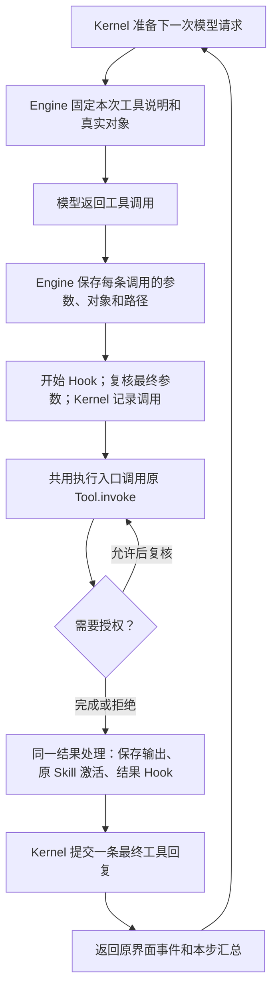

# Tool Engine 实现说明

本次重构仍使用 `box_agent/tools/`。具体工具负责做事；其中的 `engine/` 统一处理调用前检查、执行与权限继续、结果转换。Kernel 决定何时请求模型、何时结束对话，并负责提交工具回复。Skill 仍提供做事方法，继续使用原加载器和会话激活状态。

## 一次调用怎样经过系统

图中的授权继续属于同一条模型调用，不重复扣预算、不重发开始 Hook；进度实时经过原事件通道。普通失败、超时或副作用是否完成未知时，不自动重放。并行首轮收齐之后，授权按原输入顺序继续；等待授权不计入首轮批次超时。

## 代码按什么职责拆开

| 位置 | 做什么 | 关键约束 |
| --- | --- | --- |
| `tools/engine/engine.py` | 组织完整调用和串并行共用的结果完成 | 一次 outer run 一个 Engine；不销毁借用的会话资源 |
| `tools/engine/{preparation,contracts}.py` | 复制 schema，保存真实对象、别名和 MCP generation | 只复制说明；本次定义变化后拒绝执行 |
| `tools/engine/{execution,scheduler}.py` | 原 Tool.invoke、流式权限继续、原并发/取消规则 | 不复制工具，不增加通用自动重试 |
| `tools/engine/{call_contracts,budget}.py` | 显式运行参数、每条调用记录和计数 | 最终参数由该调用持有，避免平行字典和循环变量串用 |
| `tools/engine/results.py` | 原输出通道、Hook 后展示、结果存储和事件 | 完整文本、模型文本、界面内容、瞬态图片各保留原用途 |
| `tools/*_result_adapter.py`、`web_search_runtime.py`、`web_search_policy.py`、`engine/artifact_results.py` | 浏览器、文件/资源、原 Skill、搜索与产物的既有规则 | 专项处理留在 tools；不在 kernel 增加业务状态机 |
| `kernel/tool_messages.py` | 执行前记录最终参数，提交最终回复，修复中断历史 | 串行立即 flush，并行统一 flush 后再启动；Agent 不重复处理结果事件 |
| `tools/local_tool_exposure.py`、`mcp_tool_search.py` | 基础/必要工具直接提供，低频工具搜索后追加 | 完整能力表不变；别名、父子范围、generation 和权限仍生效 |

`kernel/tool_engine.py`、`permission_gateway.py`、`tool_result_pipeline.py`、`state.py` 保留原符号的兼容导出。它们不保留第二套执行逻辑。`ToolEnginePort` 由原 composition / PluginHost 解析；CLI、ACP 不需要自行构造 Engine。

## 工具与 Skill 怎样配合

新增普通 Tool 仍实现 `name`、`description`、`parameters` 和 `execute()`，注册到原工具表即可，不需要修改 loop。Engine 调用 `invoke()` 做 schema 校验。事件工具继续通过 `ToolInvocationContext` 输出进度。

低频工具完整 schema 可以延迟提供，真实实例仍由原会话拥有。`tool_search` 同时查本地和 MCP；关闭或尚未连接 MCP 不妨碍本地发现。已激活工具稳定追加到后续请求。已有 plan/todo/goal 状态、后台进程句柄和宿主必需的审批/回执流程，会使对应工具直接可用。

Skill 的 `get_skill` / 预加载 / 激活 / hash 恢复保持原行为。少量明确的 Skill 工具提示只调整已有能力的可见性，不能注册新能力或授予权限。第二阶段才重构 Skill Engine。

定时任务只改模型规范名为 `prepare_scheduled_task`，旧 `create_scheduled_task` 及 Python 类名兼容。宿主仍收到 `officev3_schedule_draft`，用户是否保存仍未知；恢复旧消息不会重新执行或再次派发草稿。

## 验证与迁移

固定 C1 schema 保持原样；C5 有意差异单独列在 `tests/fixtures/tool_engine/c5_schema_changes.json`。原工具能力、配置组合、实例身份与参数继续逐项对照，不以减少工具数量作为通过标准。

回归与真实任务的当前状态见 [实施记录](progress.md) 和 [验收结果](verification.md)。源码测试、构建、安装探针、实际宿主和真实任务分别记录。回退整个 Tool PR 可恢复旧装配与执行；没有 Session Log 格式迁移，也无需重构或重新安装原 Skill。
